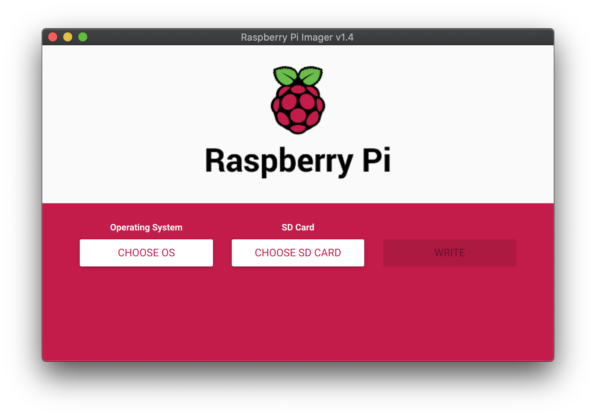
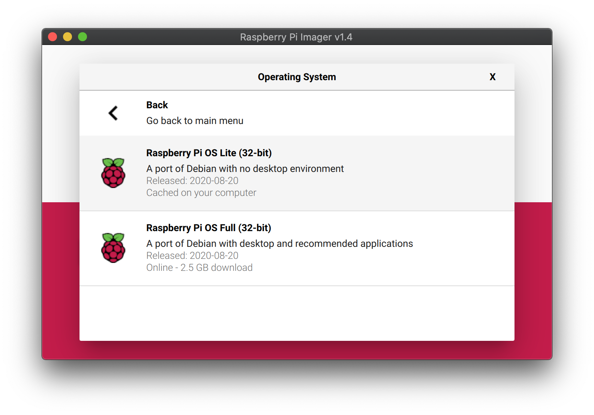
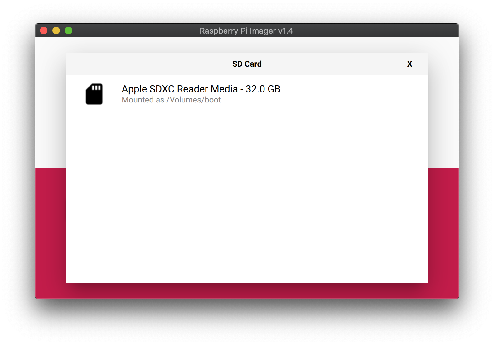

以下のステップで Home Assistant を使えるようにしていきます。

1. [必要なものと環境](/homeassistant_1)
2. **[Raspberry Pi OS のセットアップ(本記事)](/homeassistant_2)**
3. [Home Assistant のインストール](/homeassistant_3)
4. [Addon のインストール](/homeassistant_4)

# 必要なものの確認

[前回](/homeassistant_1)で紹介した必要なものがそろっているか確認してください。  
表の「私の場合」を例に紹介してまいります。

| ハードウェア等 | 私の場合                     |
| :------------- | :--------------------------- |
| Raspberry Pi   | Raspberry Pi 4 (メモリ 2GB)  |
| micro SD       | SanDisk 製 32GB              |
| 電源           | AC アダプタ                  |
| 放熱ケース     | [前回](/homeassistant_1)参照 |
| パソコン       | Mac                          |
| 自宅 LAN       | 普通の Wifi ルータ、後述     |

# Raspberry Pi OS のインストール

ここでは micro SD カードに Raspberry Pi OS を書き込みます。

> ちょっと前まで Raspberry Pi 用の OS として Raspbian という名前の Debian 系の Linux ディストリビューションがありましたが、`Raspberry Pi OS`その後継にあたります。

## microSD カードへの OS 書き込み

まずは、micro SD カードをパソコンにセットしておきます。

[公式のインストールツール`Raspberry Pi Imager`](https://www.raspberrypi.org/downloads/)を使って OS を書き込んでいきます。  
非常に簡単に使えるようになっています。

インストールしたい OS を選択し(`CHOOSE OS`)、SD カードを指定し(`CHOOSE SD CARD`)、書き込む(`WRITE`)するだけです。


デスクトップ用途はないので OS は`Raspberry OS Lite(32-bit)`を選択しました。


SD カードをパソコンに差し込んだら表示されましたので、選択。



## SSH の準備

書き込みが終わると、micro SD カードの中に`/boot`というフォルダができあがります。  
この中に空の`ssh`というファイルを作っておくことで、初回起動時に`ssh`接続できるようになります。

以下は Mac OS の場合に`ssh`ファイルを作るコマンド

```bash
touch /Volumes/boot/ssh
```

以上で micro SD カードの準備は完了です。  
お疲れさまでした。

# Raspberry Pi の初期設定

micro SD カードを Raspberry Pi に差し込み、AC アダプターを差します。  
Raspberry Pi 本体に電源スイッチはありません。コンセントに差し込んだ瞬間起動します。

数分で起動し、ssh 接続できるようになります。

## ssh で接続

Mac から ssh で接続します。  
Mac ではデフォルトで Bonjour が有効です。IP アドレスを指定せず、`raspberrypi.local`にアクセスします。  
ユーザ名はデフォルトの`pi`、パスワードは`raspberry`です。

```
ssh pi@raspberypi.local
```

以下は ssh 接続した Raspberry Pi 上の作業です。

## ファームウェアのアップデート

```
sudo rpi-update
```

## raspi-config

以下で起動します。

```
sudo raspi-config
```

さしあたり以下を設定しました。

- `8 Update`: `raspi-config`本体をアップデート
- `4 Localisation Options` => `Change Locale` => `ja_JP.UTF-8`: 日本語化
- `7 Advanced Options` => `A1 Expand Filesystem`: SD カードの記憶領域全体を OS で使用可能に。

## パッケージのアップデート

いつもの。

```bash
sudo apt-get update　
sudo apt-get upgrade
sudo apt-get dist-upgrade
sudo apt-get clean
```

## スワップの無効化

SD カードの寿命を伸ばすための工夫です。

```bash
sudo swapoff --all
sudo apt-get purge -y --auto-remove dphys-swapfile
sudo rm -fr /var/swap
```

## root パスワードの変更

```bash
sudo passwd root
```

## ユーザの追加

新しいユーザを追加します。`testuser`の部分は自分の設定するユーザ名に置き換えてください。  
新しいユーザで ssh 接続可能なことを確認した上で、デフォルトの`pi`アカウントは消してしまいます。

```bash
$ groups pi
pi : pi adm dialout cdrom sudo audio video plugdev games users input netdev spi i2c gpio
$ sudo useradd testuser
$ sudo usermod -G adm,dialout,cdrom,sudo,audio,video,plugdev,games,users,input,netdev,spi,i2c,gpio testuser # pi以外のグループを引継
# ここで新しいアカウントでログインし直し、接続できることを確認
$ sudo userdel pi
```
