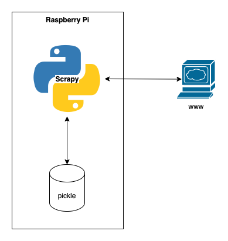
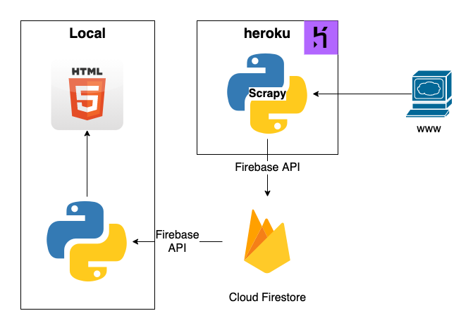
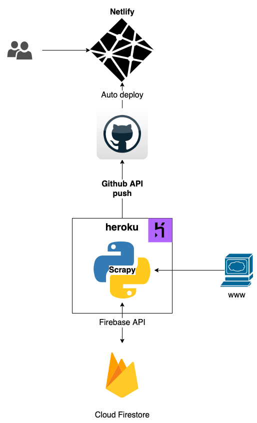

import MyYoutube from "../../MyYoutube";
import RakutenAffiliate from "../../RakutenAffiliate";

#### まえがき
世の中には実に様々なジャンルがあります。  
大きなジャンルですと、情報が整理整頓されたポータルサイトやまとめサイトになっていたり、
さらに大きくなると会社にまでなっています。

しかし、小さいジャンル、需要がそれほど多くないジャンルになると、
途端にまとまった情報がなくなり、いちいち雑多なウェブサイトを巡回することになります。  
やれないことはありませんが、時間の浪費です。

RSSを登録したりして何とか情報を集めようとしましたが、これも面倒でした。

#### ローカルでクローリング

まずは個人的に利用するためにクローリングすることからはじめました。  
クローリングによって得られる情報を毎日ためておき、差分から最新情報をまとめて閲覧できる仕組みを構築しました。  
Raspberry Pi上で`crontab`を設定し、定期的に実行させていました。

- クローリング: [Scrapy](https://doc.scrapy.org/en/latest/index.html)
- データベース: pickleファイルとしてローカルに保管

#### クラウドサービスへ移行
徐々にCPU温度やSDカードの寿命が気になり始め、すべて無料のクラウド環境に移行しました。

- クローリング: herokuの無料Scheduler Dynoでpythonを動かす
- データベース: FirebaseのCloud Firestoreを無料の範囲内で運用
- 可視化: PythonでFirebaseにアクセスし、簡易なhtmlに変換

#### Webサイトへ
最終的に、収益化のためWebサイトに移行しました。  
- 独自ドメイン: お名前ドットコムで取得
- ホスティング: Netlify(Githubから自動デプロイ)
- フロントエンド: Gatsby

#### 最後に
もともと自分のために作っていた情報ポータルをWeb上に公開する仕組みを構築しました。

現状費用がかかっているのは独自ドメインの更新料のみです。
収益化はコンテンツ的に難しそうなので、いずれNetlifyのサブドメインに戻すかもしれません。

この経験を生かしてもっと多彩な分野でニッチな需要のある情報ポータルを作って行こうと思います。