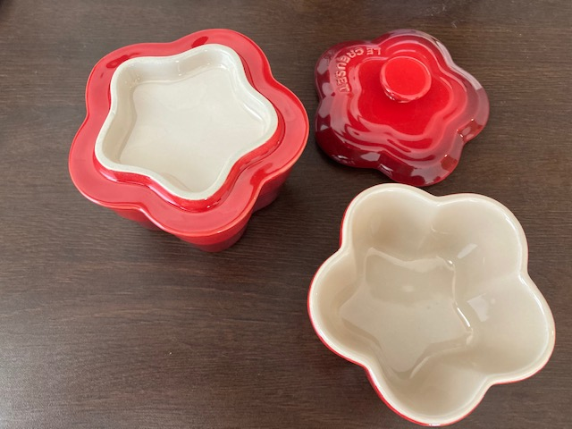
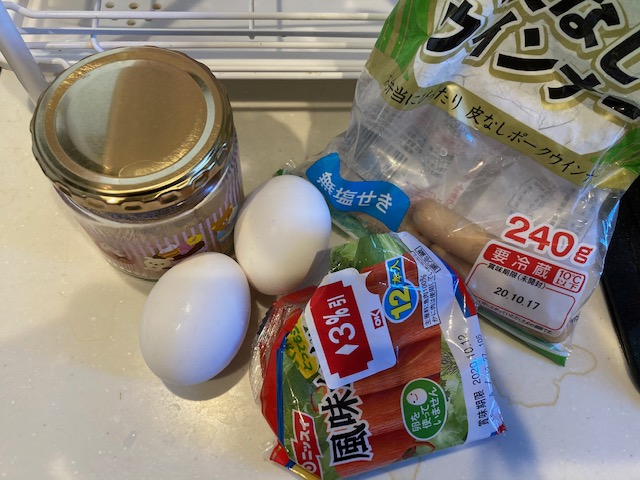
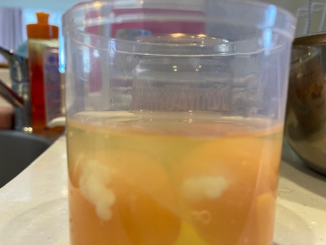
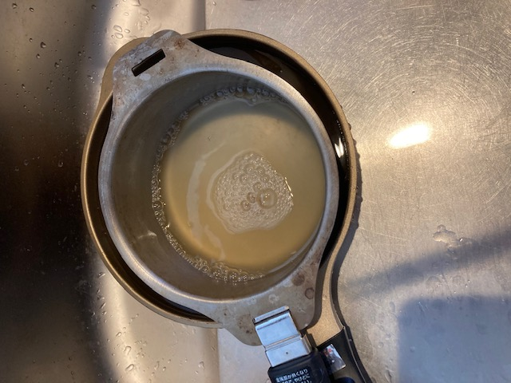
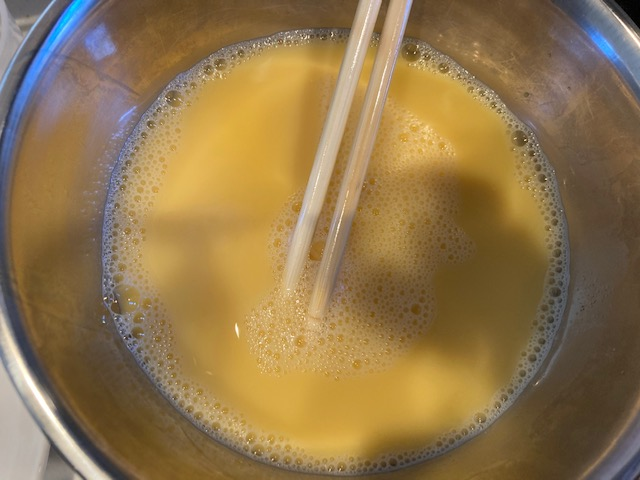
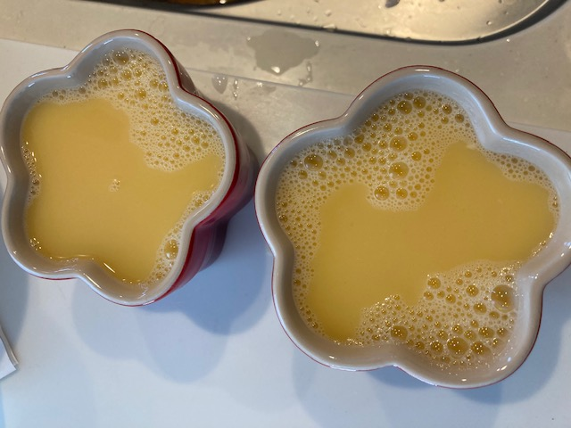
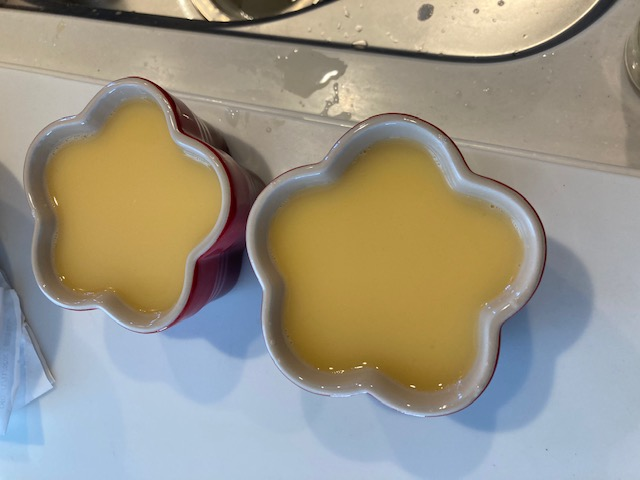
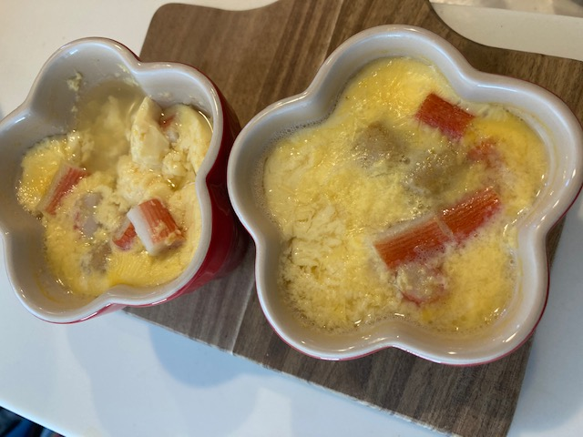

import MyYoutube from "../../MyYoutube";
import RakutenAffiliate from "../../RakutenAffiliate";

わたし、茶碗蒸し大好きなんです。

今の同居人と住み始める前に、

**俺、一緒に住み始めたら茶碗蒸し極めるわ**

と宣言していました。  
でも面倒なので忘れたことにしていました。

そんなある日、同居人が某所のアウトレットで余計なものを買ってきました。  
電子レンジ・オーブン・蒸し器・圧力鍋・冷蔵・冷凍・食洗機使用可能で、便利みたいですね（棒） 。  
仕方ないので勉強し始めることにします。

<RakutenAffiliate
  url="https://hb.afl.rakuten.co.jp/ichiba/1d7bbb36.3bbca8c4.1d7bbb37.50ba00ae/?pc=https%3A%2F%2Fitem.rakuten.co.jp%2Fdaily-3%2Flecn0174%2F&link_type=picttext&ut=eyJwYWdlIjoiaXRlbSIsInR5cGUiOiJwaWN0dGV4dCIsInNpemUiOiIyNDB4MjQwIiwibmFtIjoxLCJuYW1wIjoicmlnaHQiLCJjb20iOjEsImNvbXAiOiJkb3duIiwicHJpY2UiOjEsImJvciI6MSwiY29sIjoxLCJiYnRuIjoxLCJwcm9kIjowLCJhbXAiOmZhbHNlfQ%3D%3D"
  title="ルクルーゼ （ル・クルーゼ） ラムカン・フルール S （フタ付） 選べる3カラー（レッド・オレンジ・ピンク） Le Creuset ギフト・のし可"
  imgurl="https://hbb.afl.rakuten.co.jp/hgb/1d7bbb36.3bbca8c4.1d7bbb37.50ba00ae/?me_id=1213885&item_id=10321891&pc=https%3A%2F%2Fthumbnail.image.rakuten.co.jp%2F%400_mall%2Fdaily-3%2Fcabinet%2Flec%2Flecn0174.jpg%3F_ex%3D240x240&s=240x240&t=picttext"
  value="価格：2857円（税込、送料別)"
  value_date="(2020/10/31時点)"
/>

## 今日の師匠

今回は以下のレシピをもとに作成していきます！

[Foodie プロ直伝、茶碗蒸しレシピ。卵と出汁は 1:3 が黄金比！](https://mi-journey.jp/foodie/49227/)

今日の師匠は**村井りんご**先生です！  
ちょっとググってみました！

ありましたよー！公式サイト！

**[フードコーディネーターになるためのブログ講座](http://murairingo.com/)**

2017 年で更新止まってる！  
メルマガ登録ページがやべえ！  
**100 万円当選ました！**のあれと同じじゃないですか！笑

https 化されてないのも気になります笑

## 材料

レシピと実際に私が使った材料です。

4 人分です。

| レシピ           | 私の材料               |
| :--------------- | :--------------------- |
| 卵 L サイズ 2 個 | 卵サイズ不明 ×2 個     |
| 和風だし         | だし(粉のやつ)小さじ 1 |
| 塩小さじ 1/4     | -                      |
| 鳥もも肉 20g     | ソーセージ 2 本        |
| かまぼこ 4 枚    | かにかま 3 本          |
| しいたけ 4 枚    | -                      |
| 三つ葉           | -                      |

## 経過

使う材料を集合させました。  
ソーセージ開封されてたけど大丈夫なのか？笑  
かにかまも賞味期限めっちゃすぎてますね・・・

**卵と出汁は 1:3 が黄金比！**らしいので、きちんと卵の体積をはかります。  
画像では見えないですが、120ml 弱でした。

出汁をつくって人肌まで冷やします。

卵と混ぜました。
泡が立たないほうがいいらしい。

材料はこれだけ。ちょっとさみしい 😅

入れました。そして泡がなくなるまで除去しました。

## 完成品

まずは電子レンジ 200W で 6 分、その後 1 分を繰り返しました。

一向に固まる気配が無い・・・

10 回くらい繰り返し、やっとまともになりました。  
ボロボロですね笑。まあ一回目なのでよしとしましょう。  
スターダムへの道のりは始まったばかりです！

