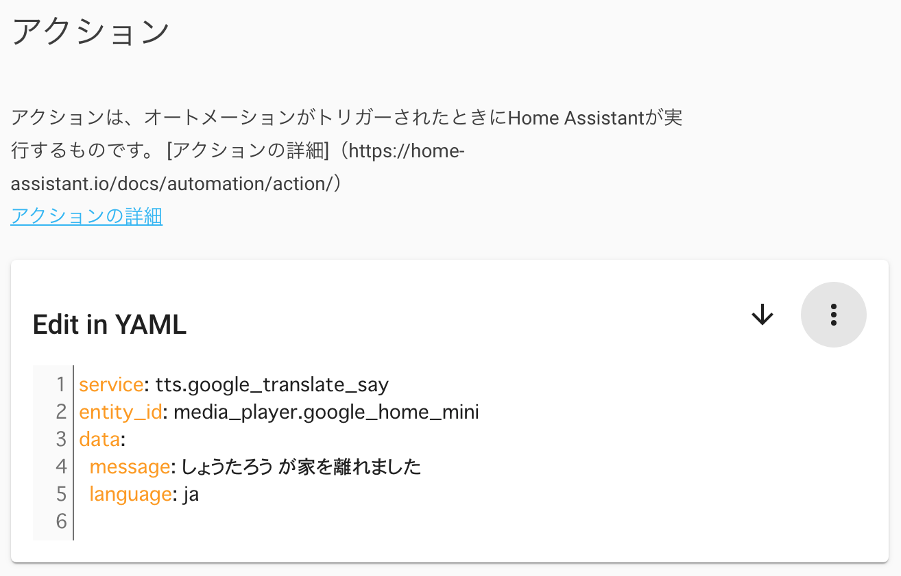

import MyYoutube from "../../MyYoutube";
import RakutenAffiliate from "../../RakutenAffiliate";

## オートメーションとは

Home Assistant ではセンサー値やイベントに応じて任意のアクションを発生させることができます。

今回は一例として、

1. **(イベント): 私が家を出た際に**
2. **(条件): 同居人が家にいるときだけ**
3. **(アクション): Google Home にその旨を tts(text to speech)でしゃべらせる**

オートメーションを登録してみます。

こちらのオートメーションは Google Home や Google NEST が Home Assistant に登録されており、位置情報をスマートフォンアプリとやり取りしている状態を前提としています。

- [App Store リンク](https://apps.apple.com/jp/app/home-assistant/id1099568401)
- [Google Play リンク](https://play.google.com/store/apps/details?id=io.homeassistant.companion.android)

<RakutenAffiliate
  url="https://hb.afl.rakuten.co.jp/ichiba/1d71f730.811d6a9d.1d71f731.09e7e11f/?pc=https%3A%2F%2Fitem.rakuten.co.jp%2Fworld-depo%2Fm-ctc0167%2F&link_type=picttext&ut=eyJwYWdlIjoiaXRlbSIsInR5cGUiOiJwaWN0dGV4dCIsInNpemUiOiIyNDB4MjQwIiwibmFtIjoxLCJuYW1wIjoicmlnaHQiLCJjb20iOjEsImNvbXAiOiJkb3duIiwicHJpY2UiOjEsImJvciI6MSwiY29sIjoxLCJiYnRuIjoxLCJwcm9kIjowLCJhbXAiOmZhbHNlfQ%3D%3D"
  title="◆Google NEST MINI ネストミニ チョーク 旧ホームミニ本体 Google アシスタント 小型スマートスピーカー bluetooth Wi-Fi 音声 認識 ハンズフリー ライトグレー 人工知能AI IOT Android iOS home mini"
  imgurl="https://hbb.afl.rakuten.co.jp/hgb/1d71f730.811d6a9d.1d71f731.09e7e11f/?me_id=1284941&item_id=11388883&pc=https%3A%2F%2Fthumbnail.image.rakuten.co.jp%2F%400_mall%2Fworld-depo%2Fcabinet%2Fgoq001%2F634_1.jpg%3F_ex%3D240x240&s=240x240&t=picttext"
  value="価格：2300円（税込、送料無料)"
  value_date="(2020/10/27時点)"
/>

## オートメーションの登録

### 概要の設定

まずは設定画面からオートメーションを選択し、右下の＋ボタンで新しいオートメーションを作成していきます。


次にオートメーションの概要を Home Assistant に伝えてあげます。  
内容を[Almond](https://almond.stanford.edu/)が解釈し、適当な設定をしてくれるようです。


解釈された結果、対象となる人物を選択するダイアログが出てきました。すごいですね。


### 詳細設定

詳細設定画面に移ります。

#### トリガー

Almond が設定してくれたものから変更していません。


#### 条件

同居人が家にいるときだけ発動する条件を加えました。


#### アクション

アクションは`Edit in YAML`の内容を[tts のページ](https://www.home-assistant.io/integrations/tts/)を参考に作成しました。



tts だけでなく、[notify](https://www.home-assistant.io/integrations/notify/)を使ってスマートフォンに通知を送るとさらに便利になりますね。

### 実行テスト

オートメーションの保存後に一覧画面に戻ると、定義したオートメーションが表示されているのが分かります。

「トリガー」をクリックすると、設定したトリガーを模擬することができます。これで実行テストができますね。


## 生の設定ファイル

以上で設定したオートメーションは`automations.yaml`に保存されています。  
File Editor 等で確認してみてください。

```yaml:title=/config/automations.yaml
- id: "1603610337269"
  alias: tts when i leave home
  description: ""
  trigger:
    - platform: zone
      entity_id: person.shotaro
      zone: zone.home
      event: leave
  condition:
    - condition: zone
      entity_id: person.sayaka
      zone: zone.home
  action:
    - service: tts.google_translate_say
      entity_id: media_player.google_home_mini
      data:
        message: しょうたろう が家を離れました
        language: ja
```

## 最後に

Home Assistant のオートメーションを実例をもとに説明しました。

アクションの設定はサンプルがないと厳しいですが、その他はほぼ直感的に設定できたと思います。
この例を出発点とし、様々なセンサ値からオートメーションを作成していこうと思います。

HomeAssistant に関する記事は[こちら](/tags/home-assistant)。
