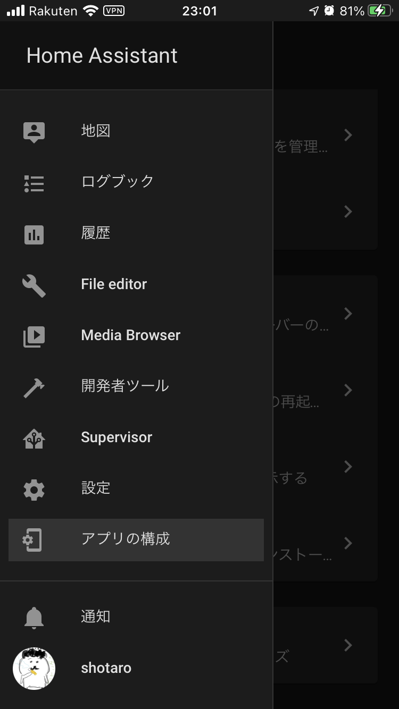

import MyYoutube from "../../MyYoutube";
import RakutenAffiliate from "../../RakutenAffiliate";

### ダウンロードリンク

以下のリンクからダウンロードできると思います。

- [App Store リンク](https://apps.apple.com/jp/app/home-assistant/id1099568401)
- [Google Play リンク](https://play.google.com/store/apps/details?id=io.homeassistant.companion.android)

### スマートフォンアプリのメリット

HomeAssistant は web から操作できるので、スマートフォンのブラウザでも同じように操作することができます。

それならなぜ専用アプリをインストールするのか、
それは**様々なスマートフォンのセンサ値を Home Assistant に登録したり、
Home Assistant から通知を受け取ったりすることができる**からです。

以下では設定方法やセンサ値について紹介していきます。

### 設定方法

まずは LAN 内でログインされることをおすすめします。  
登録したユーザ名、パスワードでログインしていきます。

ブラウザ版と異なり、左ペインの一番下に「アプリの構成」という項目があります。

さしあたり重要となるのが Connection です。

Interal URL には固定したプライベート IP アドレスを、External URL には DuckDNS や ngrok Client で取得した出先用の URL を入力します。

- [IP 固定アドレスの固定についての記事](/home-assistantを使えるようにするまで-その-3)
- [DuckDNS/ngrok Client についての記事](/home-assistantを使えるようにするまで-その-5)

もう 1 つ確認しておきたいのが、位置情報(Location)を常に有効化していることです。

### センサ値

スマートフォンからは多数のセンサ値を取得できます。  
スマートフォンの種類によって多少異なるかもしれません。こちらは iPhone SE2 の一例です。  
どう考えても使いみちのないものも含まれていますが、位置情報やバッテリー残量の情報は使えそうです。

- device_tracker.xxx_iphone
- sensor.xxx_iphone_activity
- sensor.xxx_iphone_average_active_pace
- sensor.xxx_iphone_battery_level
- sensor.xxx_iphone_battery_state
- sensor.xxx_iphone_bssid
- sensor.xxx_iphone_connection_type
- sensor.xxx_iphone_distance
- sensor.xxx_iphone_floors_ascended
- sensor.xxx_iphone_floors_descended
- sensor.xxx_iphone_geocoded_location
- sensor.xxx_iphone_last_update_trigger
- sensor.xxx_iphone_sim_1
- sensor.xxx_iphone_sim_2
- sensor.xxx_iphone_ssid
- sensor.xxx_iphone_steps
- sensor.xxx_iphone_storage

## センサ値の LoveLace UI への登録

本筋からずれますが、 LoveLace UI と呼ばれる、左ペイン「状態」をクリックすると表示される画面に
バッテリー残量をカードにして表示してみようと思います。

1. 右上のボタンから「ダッシュボードを編集」をクリックします。
1. 右下に現れた＋ボタンをクリックします。
1. By Entity タブを開き、`sensor.xxx_iphone_battery_level`にチェックを入れ、`CONTINUE`します。
1. カードを提案してくれるのですが、今回は表示されませんでした。「別のカードを選択する」をクリックします。
1. 今回は「ゲージ」のカードを選択します。

カードの内容をいろいろ設定できるようです。  
クールなカードができあがりました笑

## 最後に

スマートフォン向けの Home Assistant アプリの使い方と設定について紹介しました。

スマートフォンを手放す人はほとんどいない世の中ですから、スマートフォンのセンサ情報は個人そのものと言っても過言ではありません。  
様々な活用方法があると思います。位置情報を活用した事例について[こちらの記事](/home-assitantのオートメーション)で紹介しています。

また、通知機能を使うことで、出先でも家の状態をすぐに知ることができます。

新たに IoT 機器を購入しないで遊べることも大きなメリットでしょう。

最後までお読みいただきありがとうございました。
