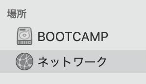
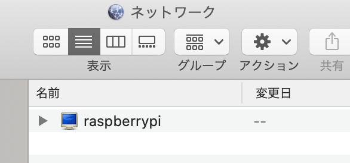
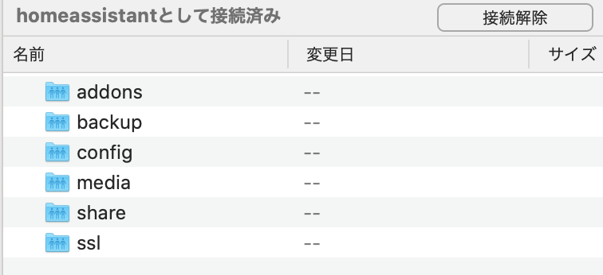

以下のステップで Home Assistant を使えるようにしていきます。

1. [必要なものと環境](/home-assistantを使えるようにするまで-その-2)
2. [Raspberry Pi OS のセットアップ](/home-assistantを使えるようにするまで-その-3)
3. [Home Assistant のインストール](/home-assistantを使えるようにするまで-その-4)
4. **[Add-on の使い方(本記事)](/home-assistantを使えるようにするまで-その-5)**

### Add-on とは

詳細は[公式サイト](https://www.home-assistant.io/addons/)を御覧ください。

Add-on は本当に様々なことができるようになります。  
HomeAssistant は Python パッケージなので、Python が使える範囲であれば大抵の機能は追加できますが、
Add-on は docker コンテナなので、さらに幅が広がります。

紹介したい Add-on は山程あるので、本当に便利なものを紹介したいと思います。

### Add-on のインストール方法

HomeAssistant のホーム画面の左ペインに「Supervisor」があります。  
「Add-on Store」に進み、インストールしたいものを検索、選択します。

今回は「File Editor」をクリックしてみます。

画面遷移後、「INSTALL」をクリックします。  
これでインストール完了です。

Add-on によっては、その後の設定が必要になることがあります。  
その設定ファイルの編集に使えるのがこの「File Editor」です。

「INSTALL」の右側に現れた「OPEN WEB UI」をクリックします。

こんな画面が表示されたでしょうか？  
File Editor はファイルブラウザ兼エディタの機能を持っており、`configuration.yaml`をはじめとした設定ファイルの編集にとても便利です。


### DuckDNS / ngrok Client

LAN 内のセットアップはできましたが、このままでは Wifi の届かない出先では Home Assistant は使えません。  
なんとかして外のネットワークに我が家の HomeAssistant を公開する必要があります。

これを実現する Add-on が「DuckDNS」または「ngrok Client」です。

どちらを選択するかは、ネットワークの大元にグローバル IP アドレスが振られているか、プライベート IP アドレスが振られているかによって決まります。  
マンションタイプの方のほとんどはプライベート IP アドレスと考えていいと思います。

私もあまり詳しくないのでなんとも言えませんが、`traceroute`コマンドの出力を判断の材料とすることができます。  
例えば私の環境で Raspberry Pi から実行した場合は以下のように表示されます。

```bash
$ traceroute google.co.jp
traceroute to google.co.jp (216.58.197.163), 30 hops max, 60 byte packets
 1  192.168.0.1 (192.168.0.1)  2.718 ms  2.542 ms  2.334 ms  # 家のWifiルータ
 2  192.168.**.** (192.168.**.**)  2.179 ms  2.063 ms  1.955 ms  # マンションのルータ？
 3  **.jp (**.**.**.**)  4.711 ms  5.107 ms  4.820 ms  # さらに上流のプロバイダのアドレス
...
```

以上から、私は「DuckDNS」を使える環境に無いので、「ngrok Client」について紹介いたします。

#### 非公式レポジトリの追加

Add-on Store には HomeAssistant 公式の Add-on のみ表示されており、
個人で開発されている Add-on は表示されていません。

これらをインストールするには公式レポジトリ以外に非公式のレポジトリに登録する必要があります。

Supervisor で右上の設定ボタンをクリックし、Repositories を選択します。  
デフォルトでは公式コミュニティの Home Assistant Comminity Add-ons のレポジトリに登録されています。  
Add Repository から`https://github.com/ThePicklenat0r/hassio-addons`を追加します。

すると Add-on Store に ngrok Client が追加されていることが確認できると思います。

#### ngrok とは

[ngrok](https://ngrok.com/)とは、ngrok サーバを通して localhost 環境を公開できる仕組みです。  
Home Assistant で使用する https に加え、tcp 接続(ssh)も可能です。

いくつか課金プランがありますが、今回の用途ならば FREE プランで十分です。  
ユーザ登録(Sign up)し、ユーザページで 30 文字程度の authtoken をメモしておいてください。

#### ngrok Client のインストール・使い方

さっそく INSTALL します。  
使い方は Documentation タブに書いてあります。  
Configuration タブで設定を追加する必要があるようです。以下に私の無料版 ngrok の例を紹介します。
下にある Network はそのままで OK です。

```yaml
log_level: info
auth_token: ngrokのサイトで取得したauthtoken
region: ap
tunnels:
  - name: hass
    proto: http
    addr: 8123
    inspect: false
```

SAVE したら Info タブに戻り、START します。

#### 公開 URL 取得

出先で Home Assistant にアクセスする URL を取得するにはセンサーを設定する必要があります。

先程インストールした File editor を使い、configuration.yaml に以下を追記します。

```yaml:title=configuration.yaml
sensors:
  - platform: rest
    resource: http://localhost:4040/api/tunnels/hass
    name: Home Assistant URL
    value_template: "{{ value_json.public_url }}"
```

設定を反映するため、Home Assistant を再起動します。  
「設定」→「サーバーコントロール」→「再起動」で再起動できます。

再起動後、「開発者ツール」→「状態タブ」→「sensor.home_assistant_url」に外部からのアクセス用の URL が表示されています。

iPhone や Android のアプリで使用する場合、External IP アドレスにこのアドレスを、Internal IP アドレスに Raspberry Pi の LAN アドレスを指定しておきます。

スマートフォン用アプリについて[こちらの記事](/home-assistantのスマートフォンアプリ)で紹介しています。

### Samba share

Samba です。LAN 内でファイルの共有ができます。

INSTALL し、Documentation を見ながら Configuration を自分用に設定していきます。  
私がデフォルトから変えたところは、以下になります。

- username: ご自由に
- password: ご自由に
- allow_hosts: 自分のプライベートアドレスのクラスに合わせて選択

START すると、パソコン等からアクセスできるようになります。  
Mac の Finder の場合は、左サイドバーの「場所」→「ネットワーク」に進むと、Raspberry Pi のホスト名が表示されます。  
ここでユーザ名とパスワードを入力すると Samba にアクセスできるようになりました。







Raspberry Pi 上のアクセス先は HomeAssistant の設定が保存されたフォルダになります。
設定ファイル(config)をエディタで編集したり、音楽・動画などのメディア(media)を保存しておいて再生することもできるようになります。

## 最後に

4 つの記事で Home Assistant を使えるようにしました。  
ここから先は TIPS 的にデバイスの追加やそのセットアップについて記事にしていこうと思います。  
ご覧いただきありがとうございました！

HomeAssistant に関する記事は[こちら](/tags/home-assistant)。
