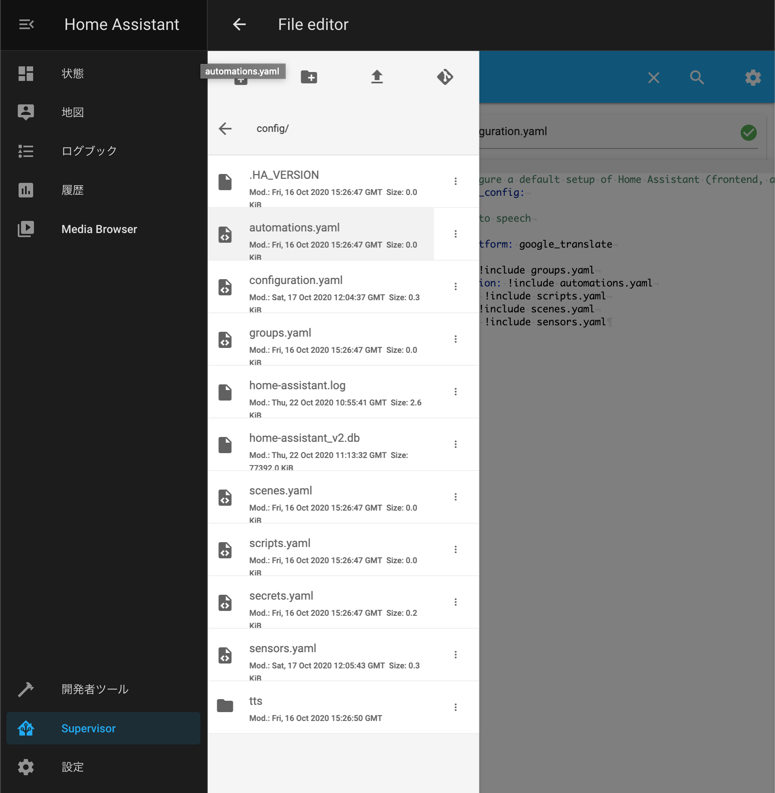

以下のステップで Home Assistant を使えるようにしていきます。

1. [必要なものと環境](/home-assistantを使えるようにするまで-その-2)
2. [Raspberry Pi OS のセットアップ](/home-assistantを使えるようにするまで-その-3)
3. [Home Assistant のインストール](/home-assistantを使えるようにするまで-その-4)
4. **[Add-on の使い方(本記事)](/home-assistantを使えるようにするまで-その-5)**

### Add-on とは

詳細は[公式サイト](https://www.home-assistant.io/addons/)を御覧ください。

Add-on は本当に様々なことができるようになります。  
HomeAssistant は Python パッケージなので、Python が使える範囲であれば大抵の機能は追加できますが、
Add-on は docker コンテナなので、さらに幅が広がります。

紹介したい Add-on は山程あるので、本当に便利なものを紹介したいと思います。

### Add-on のインストール方法

HomeAssistant のホーム画面の左ペインに「Supervisor」があります。  
「Add-on Store」に進み、インストールしたいものを検索、選択します。

今回は「File Editor」をクリックしてみます。

画面遷移後、「INSTALL」をクリックします。  
これでインストール完了です。

Add-on によっては、その後の設定が必要になることがあります。  
その設定ファイルの編集に使えるのがこの「File Editor」です。

「INSTALL」の右側に現れた「OPEN WEB UI」をクリックします。

こんな画面が表示されたでしょうか？  
File Editor はファイルブラウザ兼エディタの機能を持っており、`configuration.yaml`をはじめとした設定ファイルの編集にとても便利です。



## DuckDNS or ngrok Client

LAN 内のセットアップはできましたが、このままでは Wifi の届かない出先では Home Assistant は使えません。  
なんとかして外のネットワークに我が家の HomeAssistant を公開する必要があります。

これを実現する Add-on が「DuckDNS」または「ngrok Client」です。

どちらを選択するかは、ネットワークの大元にグローバル IP アドレスが振られているか、プライベート IP アドレスが振られているかによって決まります。  
マンションタイプの方のほとんどはプライベート IP アドレスと考えていいと思います。

私もあまり詳しくないのでなんとも言えませんが、traceroute コマンドの出力を判断の材料とすることができます。  
例えば私の場合は以下のように表示されます。

```
$ traceroute google.co.jp
traceroute to google.co.jp (216.58.197.163), 30 hops max, 60 byte packets
 1  192.168.0.1 (192.168.0.1)  2.718 ms  2.542 ms  2.334 ms
 2  192.168.10.231 (192.168.10.231)  2.179 ms  2.063 ms  1.955 ms
 3  ike-gw12.transix.jp (14.0.9.130)  4.711 ms  5.107 ms  4.820 ms
 4  ike-bbrt10.transix.jp (14.0.9.129)  5.133 ms  5.056 ms  4.878 ms
 5  72.14.222.189 (72.14.222.189)  5.394 ms  5.616 ms  5.439 ms
 6  * * *
 7  108.170.242.193 (108.170.242.193)  6.322 ms 72.14.233.34 (72.14.233.34)  5.251 ms 142.250.226.60 (142.250.226.60)  6.967 ms
 8  108.170.242.208 (108.170.242.208)  5.221 ms 216.239.62.27 (216.239.62.27)  4.876 ms 216.239.62.29 (216.239.62.29)  5.418 ms
 9  nrt12s02-in-f3.1e100.net (216.58.197.163)  5.222 ms  5.155 ms 209.85.241.107 (209.85.241.107)  6.434 ms
```
