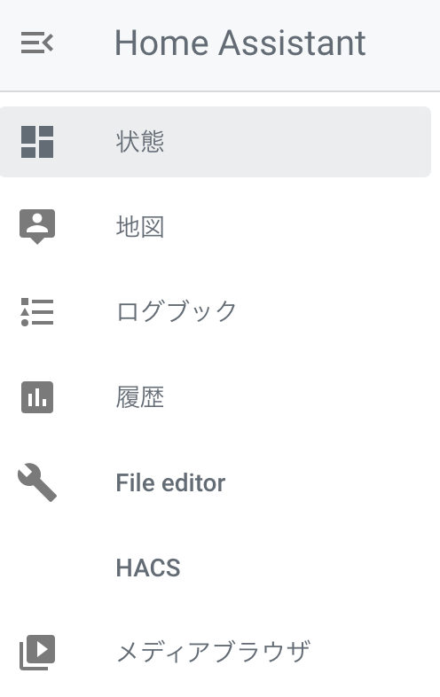
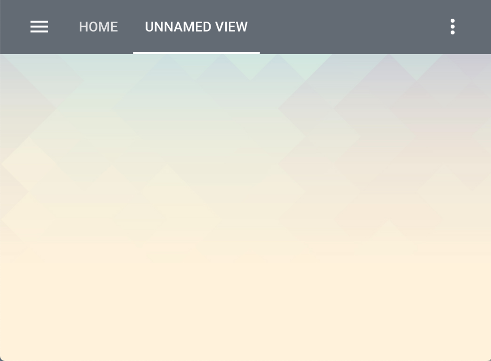

import MyYoutube from "../../MyYoutube";
import RakutenAffiliate from "../../RakutenAffiliate";


### HACSとは
[HACS(Home Assistant Community Store)](https://hacs.xyz/)を使うと、サードパーティ製コンポーネントを
Home Assistantから簡単にインストールすることができます。  
非公式のもの、個人開発のものがほとんどですが、便利なものも多いので、インストールしておくことをおすすめします。

### インストール

#### ダウンロード
[こちら](/home-assistantを使えるようにするまで-その-4)に従ってHome Assistantをインストールした場合、
設定ファイルは以下のディレクトリに保存されています。

```
/usr/share/hassio/homeassistant
```

[こちら](https://hacs.xyz/docs/installation/manual_cli)に従ってCLIでインストールします。

```bash
cd /usr/share/hassio/homeassistant
curl -sfSL https://hacs.xyz/install | sudo bash -
```

やっていることは非常に単純で、githubレポジトリからzipファイルを落としてきて、
`custom_components`フォルダに`HACS`本体を展開しているだけです。

```
$ ls custom_components
hacs
```

#### Githubのアクセストークンの取得
[こちら](https://hacs.xyz/docs/configuration/pat)に従って GithubのPersonal Access Tokenを取得します。  

#### インストール
まずはHome Assistantを再起動します。  
1. 左ペインの設定
1. サーバーコントロール
1. サーバー管理
1. 再起動

次にHACSをインストールします。
1. 左ペインの設定
1. インテグレーション
1. 右下の`インテグレーションを追加`ボタン
1. `hacs`で検索し、選択
1. 上記のGithub Access Tokenを入力

左ペインにHACSが現れ、インストールできたことが確認できます。


### 使い方
ここではサードパーティのテーマをインストールしてみます。

1. 左ペインのHACS
1. Frontend
1. 右下の`+`ボタン
1. `Lovelace`のチェックを外し、お好きなテーマを探します

`Clear Theme`をインストールしてみます。

1. 一覧からインストールするテーマをクリック
1. 右下の`INSTALL THIS REPOSITORY IN HACS`ボタンをクリック
1. `INSTALL`をクリック

以下を`configuration.yaml`に追加し、Home Assistantを再起動します。

```yaml
frontend:
  themes: !include_dir_merge_named themes
```

最後に、左ペインのユーザアカウントからテーマを選択します。


