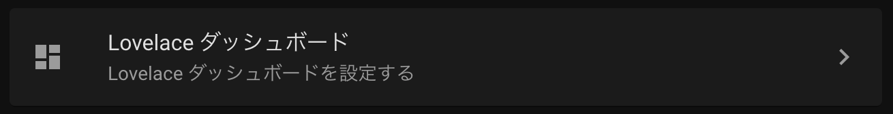

import MyYoutube from "../../MyYoutube";
import RakutenAffiliate from "../../RakutenAffiliate";

HomeAssistant が初めての方は[こちらの記事](/home-assistantを使えるようにするまで-その-1)をご覧ください。

## Home Assistant の設定画面

左ペインの設定をクリックすると、Home Assistant の設定画面になります。
上から順番に説明していきます。  
File editor Add-on 等をインストール済みで、設定用の yaml ファイルは編集可能な状態を想定しています。

## 1 枚目のカード（Home Assistant Cloud）

割愛します。  
クリックしたページに書かれているとおりです。私は登録していません。

## 2 枚目のカード

このカードでは、スマートフォンやセンサ等のデバイス、
はデバイスから得られる情報、デバイスに与えることが可能な情報について取り扱っています。

説明の関係上、インテグレーションは最後に回しています。

### デバイス

デバイスには以下のようなものが含まれます。  
文字通り物理的なデバイスを指すようです。

- iPhone
- Chromecast
- スマート電球
- スマートリモコン
- Wifi ルータ

### エンティティ　

エンティティのカバーする範囲は非常に広いです。  
例えば以下のようなものが含まれます。

- CPU 温度
- iPhone の位置情報
- iPhone のバッテリー残量
- HomeAssistant のアカウント
- 自宅の天気
- 家の座標・時刻における太陽の状態

### インテグレーション

インテグレーションとは、サービス等との**総合的な**HomeAssistant との統合です。  
サービスの中から上記のデバイス、エンティティを統合します。

例えば「iPhone アプリ」、というサービスでは、iPhone というデバイス、iPhone の位置情報等のエンティティが登録されます。

### エリア

エリアは自宅内に設定する部屋割です。  
エリアは自分で追加登録・変更・削除が可能です。  
各デバイスにはエリアを登録することができます。

## 3 枚目のカード

### オートメーション

### シーン

### スクリプト

### ヘルパー

## 4 枚目のカード（タグ）

## 5 枚目のカード（Lovelace ダッシュボード）

## 6 枚目のカード

### 人

### ゾーン

### ユーザー

## 7 枚目のカード

## 8 枚目のカード

