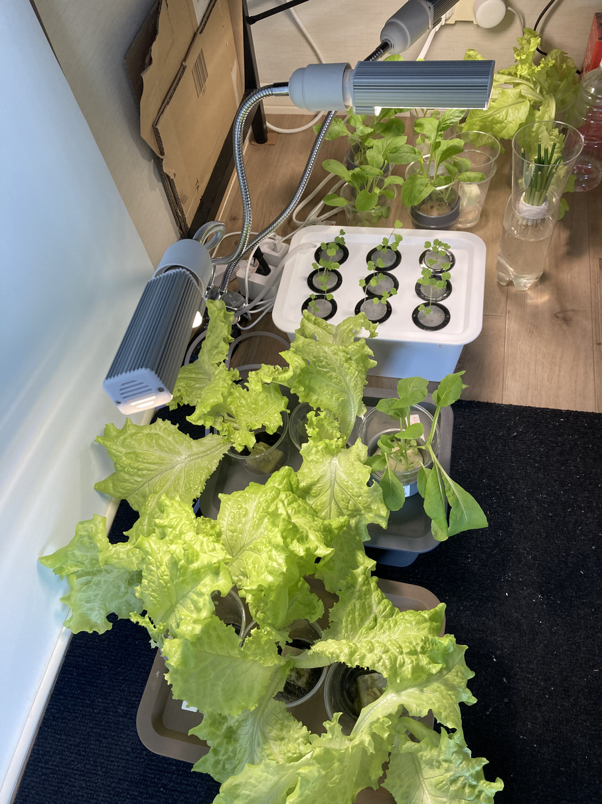
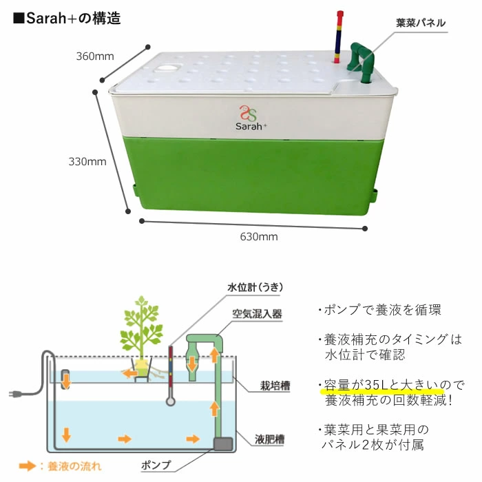
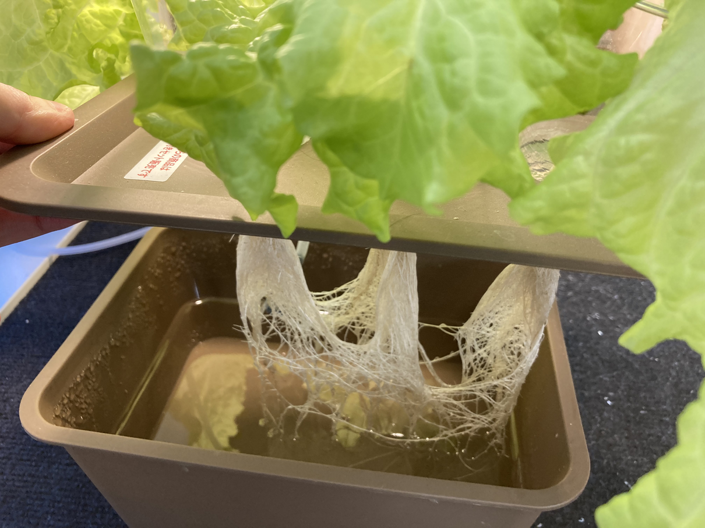
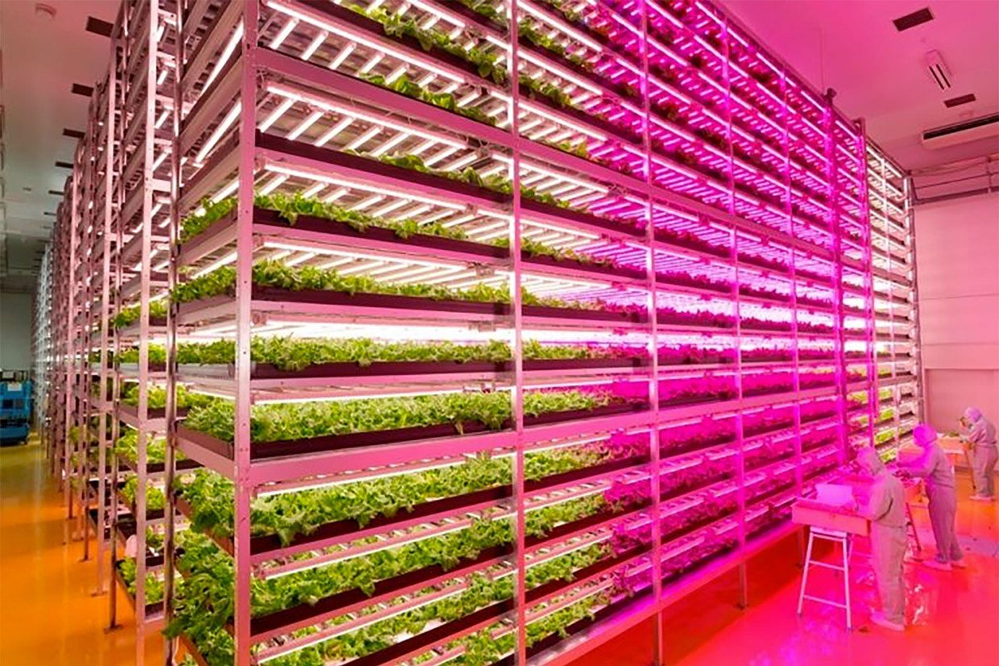

import MyYoutube from "../../MyYoutube";
import RakutenAffiliate from "../../RakutenAffiliate";

### まえがき
[LEDライト](/水耕栽培-led育成ライト)と[エアーポンプ](/水耕栽培-エアーポンプ)を導入し、私の畑もまともになりつつあります。  
ここで一気にワンステップあげていきたいところです。

年末の休暇を利用し、大規模化、そして自動化を進めていこうと思います。

## 既製品の情報収取
水耕栽培のシステムとして、実際に販売されているものを参考にすることにしました。  
既製品のいいとこ取りし、安く自作しようという魂胆です。

しかし既製品はめっちゃ高いですね〜  
いろいろ整えようと思ったら、これくらい簡単にいってしまいそうではありますが笑

### 参考その1
<RakutenAffiliate
  url="https://hb.afl.rakuten.co.jp/ichiba/1e1d7fd0.fdf29a60.1e1d7fd1.40cb85d5/?pc=https%3A%2F%2Fitem.rakuten.co.jp%2Fplusys7022%2F26349%2F&link_type=picttext&ut=eyJwYWdlIjoiaXRlbSIsInR5cGUiOiJwaWN0dGV4dCIsInNpemUiOiIyNDB4MjQwIiwibmFtIjoxLCJuYW1wIjoicmlnaHQiLCJjb20iOjEsImNvbXAiOiJkb3duIiwicHJpY2UiOjEsImJvciI6MSwiY29sIjoxLCJiYnRuIjoxLCJwcm9kIjowLCJhbXAiOmZhbHNlfQ%3D%3D"
  title="個人宅・北海道配送不可 水耕栽培キット ホームハイポニカ Sarah+ (サラプラス) [グリーン] 家庭菜園 果菜 葉もの野菜 花 トマト レタス カ園 代引不可"
  imgurl="https://hbb.afl.rakuten.co.jp/hgb/1e1d7fd0.fdf29a60.1e1d7fd1.40cb85d5/?me_id=1285727&item_id=10091030&pc=https%3A%2F%2Fthumbnail.image.rakuten.co.jp%2F%400_mall%2Fplusys7022%2Fcabinet%2Fzinbo%2F263491.jpg%3F_ex%3D240x240&s=240x240&t=picttext"
  value="価格：32807円（税込、送料無料)"
  value_date="(2020/12/20時点)"
/>

商品の説明が非常に参考になります。  
全体は栽培槽と液肥槽の2槽に別れています。
液肥をポンプで揚水して栽培槽に送り込み、
左側の配管高さを越えると液肥槽に戻される、
DFT方式とよばれる水位を維持する仕組みとなっています。

中央にある浮きもいい味だしてますよね。  
蓋を開けないでも液肥槽の水位が確認できるようになっています。

空気混入器で液肥中の酸素を供給しているようです。

### 参考その2
<RakutenAffiliate
  url="https://hb.afl.rakuten.co.jp/ichiba/1da4fe48.81fde9f6.1da4fe49.f6557a3e/?pc=https%3A%2F%2Fitem.rakuten.co.jp%2Fmorinokazoku%2F20201006043735%2F&link_type=picttext&ut=eyJwYWdlIjoiaXRlbSIsInR5cGUiOiJwaWN0dGV4dCIsInNpemUiOiIyNDB4MjQwIiwibmFtIjoxLCJuYW1wIjoicmlnaHQiLCJjb20iOjEsImNvbXAiOiJkb3duIiwicHJpY2UiOjEsImJvciI6MSwiY29sIjoxLCJiYnRuIjoxLCJwcm9kIjowLCJhbXAiOmZhbHNlfQ%3D%3D"
  title="水耕栽培キット 水耕栽培 植物 野菜用具 植物育成 家庭菜園 室内 ベランダ 水耕栽培セット (108穴)"
  imgurl="https://hbb.afl.rakuten.co.jp/hgb/1da4fe48.81fde9f6.1da4fe49.f6557a3e/?me_id=1384097&item_id=10009166&pc=https%3A%2F%2Fthumbnail.image.rakuten.co.jp%2F%400_mall%2Fmorinokazoku%2Fcabinet%2Fitem43%2F020201006042800.jpg%3F_ex%3D240x240&s=240x240&t=picttext"
  value="価格：16824円（税込、送料別)"
  value_date="(2020/12/20時点)"
/>

2つめの商品は配管を容器にしています。  
自作されている方の動画やブログ等を見ると、塩ビ配管を容器にしている人が多いですね。  
この商品は配管を並列かつ多段に接続しています。

レタスを栽培していて分かったのですが、栽培槽は根っこでめちゃくちゃになります。  
配管を容器にする方式では、液肥の流れ方向が一定になるため、株の間隔を調整すれば根が絡む心配は少なくなりそうです。

商品説明だけではわからないのですが、おそらくこちらはNFT方式を採用しています。  
NFT方式は容器を若干斜めにすることで、重力で自動的に液肥が流れる方式です。
DFT方式と比べ、少量の液肥を常にポンプで揚水する必要があります。

### 参考その3
<RakutenAffiliate
  url="https://hb.afl.rakuten.co.jp/ichiba/1e1da20c.fb59442b.1e1da20d.15241ccb/?pc=https%3A%2F%2Fitem.rakuten.co.jp%2Fimaginelife%2F862-lf-rhl4%2F&link_type=picttext&ut=eyJwYWdlIjoiaXRlbSIsInR5cGUiOiJwaWN0dGV4dCIsInNpemUiOiIyNDB4MjQwIiwibmFtIjoxLCJuYW1wIjoicmlnaHQiLCJjb20iOjEsImNvbXAiOiJkb3duIiwicHJpY2UiOjEsImJvciI6MSwiY29sIjoxLCJiYnRuIjoxLCJwcm9kIjowLCJhbXAiOmZhbHNlfQ%3D%3D"
  title="【送料無料（沖縄・離島を除く）】リビングファーム　LF-RHL4　室内水耕栽培器キット　リビングファームRH4【メーカー直送】【代引き/同梱包不可】【栽培キット/水耕栽培/栽培セット/LivingFarm】"
  imgurl="https://hbb.afl.rakuten.co.jp/hgb/1e1da20c.fb59442b.1e1da20d.15241ccb/?me_id=1298758&item_id=10045924&pc=https%3A%2F%2Fthumbnail.image.rakuten.co.jp%2F%400_mall%2Fimaginelife%2Fcabinet%2Flivingfarm%2Fimg61861185.jpg%3F_ex%3D240x240&s=240x240&t=picttext"
  value="価格：68096円（税込、送料無料)"
  value_date="(2020/12/20時点)"
/>

3つめの商品はメタルラックに容器とLEDライトを取り付けたものとなっています。  
多段式ならではですね。参考になります。

### 参考その4
最後は水耕栽培工場の販売会社です。  
こんなに食えないのであれですが、実のならない葉物野菜の水耕栽培の完成形と言えそうです

[MIRAI](https://miraigroup.jp/)

## システム全体の構成
以上の参考情報源をもとに、できるだけ簡単に安くシステムを設計していこうと思います。  

書きかけ
