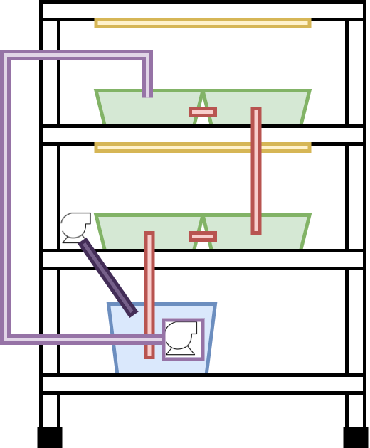

import MyYoutube from "../../MyYoutube";
import RakutenAffiliate from "../../RakutenAffiliate";
import Microlink from '@microlink/react'

### まえがき
[LEDライト](/水耕栽培-led育成ライト)と[エアーポンプ](/水耕栽培-エアーポンプ)を導入し、私の畑もまともになりつつあります。  
ここで一気にワンステップあげていきたいところです。

年末の休暇を利用し、大規模化、そして自動化を進めていこうと思います。

## 既製品の情報収取
水耕栽培のシステムとして、実際に販売されているものを参考にすることにしました。  
既製品のいいとこ取りし、安く自作しようという魂胆です。

しかし既製品はめっちゃ高いですね〜  
いろいろ整えようと思ったら、これくらい簡単にいってしまいそうではありますが笑

### 参考その1
<RakutenAffiliate
  url="https://hb.afl.rakuten.co.jp/ichiba/1e1d7fd0.fdf29a60.1e1d7fd1.40cb85d5/?pc=https%3A%2F%2Fitem.rakuten.co.jp%2Fplusys7022%2F26349%2F&link_type=picttext&ut=eyJwYWdlIjoiaXRlbSIsInR5cGUiOiJwaWN0dGV4dCIsInNpemUiOiIyNDB4MjQwIiwibmFtIjoxLCJuYW1wIjoicmlnaHQiLCJjb20iOjEsImNvbXAiOiJkb3duIiwicHJpY2UiOjEsImJvciI6MSwiY29sIjoxLCJiYnRuIjoxLCJwcm9kIjowLCJhbXAiOmZhbHNlfQ%3D%3D"
  title="個人宅・北海道配送不可 水耕栽培キット ホームハイポニカ Sarah+ (サラプラス) [グリーン] 家庭菜園 果菜 葉もの野菜 花 トマト レタス カ園 代引不可"
  imgurl="https://hbb.afl.rakuten.co.jp/hgb/1e1d7fd0.fdf29a60.1e1d7fd1.40cb85d5/?me_id=1285727&item_id=10091030&pc=https%3A%2F%2Fthumbnail.image.rakuten.co.jp%2F%400_mall%2Fplusys7022%2Fcabinet%2Fzinbo%2F263491.jpg%3F_ex%3D240x240&s=240x240&t=picttext"
  value="価格：32807円（税込、送料無料)"
  value_date="(2020/12/20時点)"
/>

商品の説明が非常に参考になります。  
全体は栽培槽と液肥槽の2槽に別れています。
液肥をポンプで揚水して栽培槽に送り込み、
左側の配管高さを越えると液肥槽に戻される、
DFT方式とよばれる水位を維持する仕組みとなっています。

中央にある浮きもいい味だしてますよね。  
蓋を開けないでも液肥槽の水位が確認できるようになっています。

空気混入器で液肥中の酸素を供給しているようです。

### 参考その2
<RakutenAffiliate
  url="https://hb.afl.rakuten.co.jp/ichiba/1da4fe48.81fde9f6.1da4fe49.f6557a3e/?pc=https%3A%2F%2Fitem.rakuten.co.jp%2Fmorinokazoku%2F20201006043735%2F&link_type=picttext&ut=eyJwYWdlIjoiaXRlbSIsInR5cGUiOiJwaWN0dGV4dCIsInNpemUiOiIyNDB4MjQwIiwibmFtIjoxLCJuYW1wIjoicmlnaHQiLCJjb20iOjEsImNvbXAiOiJkb3duIiwicHJpY2UiOjEsImJvciI6MSwiY29sIjoxLCJiYnRuIjoxLCJwcm9kIjowLCJhbXAiOmZhbHNlfQ%3D%3D"
  title="水耕栽培キット 水耕栽培 植物 野菜用具 植物育成 家庭菜園 室内 ベランダ 水耕栽培セット (108穴)"
  imgurl="https://hbb.afl.rakuten.co.jp/hgb/1da4fe48.81fde9f6.1da4fe49.f6557a3e/?me_id=1384097&item_id=10009166&pc=https%3A%2F%2Fthumbnail.image.rakuten.co.jp%2F%400_mall%2Fmorinokazoku%2Fcabinet%2Fitem43%2F020201006042800.jpg%3F_ex%3D240x240&s=240x240&t=picttext"
  value="価格：16824円（税込、送料別)"
  value_date="(2020/12/20時点)"
/>

2つめの商品は配管を容器にしています。  
自作されている方の動画やブログ等を見ると、塩ビ配管を容器にしている人が多いですね。  
この商品は配管を並列かつ多段に接続しています。

レタスを栽培していて分かったのですが、栽培槽は根っこでめちゃくちゃになります。  
配管を容器にする方式では、液肥の流れ方向が一定になるため、株の間隔を調整すれば根が絡む心配は少なくなりそうです。

商品説明だけではわからないのですが、おそらくこちらはNFT方式を採用しています。  
NFT方式は容器を若干斜めにすることで、重力で自動的に液肥が流れる方式です。
DFT方式と比べ、少量の液肥を常にポンプで揚水する必要があります。

### 参考その3
<RakutenAffiliate
  url="https://hb.afl.rakuten.co.jp/ichiba/1e1da20c.fb59442b.1e1da20d.15241ccb/?pc=https%3A%2F%2Fitem.rakuten.co.jp%2Fimaginelife%2F862-lf-rhl4%2F&link_type=picttext&ut=eyJwYWdlIjoiaXRlbSIsInR5cGUiOiJwaWN0dGV4dCIsInNpemUiOiIyNDB4MjQwIiwibmFtIjoxLCJuYW1wIjoicmlnaHQiLCJjb20iOjEsImNvbXAiOiJkb3duIiwicHJpY2UiOjEsImJvciI6MSwiY29sIjoxLCJiYnRuIjoxLCJwcm9kIjowLCJhbXAiOmZhbHNlfQ%3D%3D"
  title="【送料無料（沖縄・離島を除く）】リビングファーム　LF-RHL4　室内水耕栽培器キット　リビングファームRH4【メーカー直送】【代引き/同梱包不可】【栽培キット/水耕栽培/栽培セット/LivingFarm】"
  imgurl="https://hbb.afl.rakuten.co.jp/hgb/1e1da20c.fb59442b.1e1da20d.15241ccb/?me_id=1298758&item_id=10045924&pc=https%3A%2F%2Fthumbnail.image.rakuten.co.jp%2F%400_mall%2Fimaginelife%2Fcabinet%2Flivingfarm%2Fimg61861185.jpg%3F_ex%3D240x240&s=240x240&t=picttext"
  value="価格：68096円（税込、送料無料)"
  value_date="(2020/12/20時点)"
/>

3つめの商品はメタルラックに容器とLEDライトを取り付けたものとなっています。  
多段式ならではですね。参考になります。

### 参考その4
最後は水耕栽培工場の販売会社です。  
こんなに食えないのであれですが、実のならない葉物野菜の水耕栽培の完成形と言えそうです

<Microlink url="https://miraigroup.jp/" />

## システム構成
以上の参考情報源をもとに、できるだけ簡単に安くシステムを設計していこうと思います。  

全体案を下図にまとめました([draw.io](https://draw.io)で作成しています)。

### 概要
- DFT方式を採用します。
- 最下段に青色の液肥槽、その他の段には緑色の栽培槽があります。  
- 液肥槽から水中ポンプで最上段に液肥を送り込みます。
- 栽培槽の間は塩ビ管でつなぎます。
- 液肥槽にエアポンプで酸素を送り込みます。
- 栽培槽の各段にはテープ式のLEDライトを設置します。
　
### 液肥槽と栽培槽の容器
液肥槽と栽培槽の容器については、こちらを参考にIKEAのTROFAST（おもちゃ箱）に即決しました。  
これから購入しに行きます。

<Microlink url='https://jitaku-yasai.com/home-made/small/container/' />

### ラック
アイリスオーヤマのメタルラックを購入しました。  
耐荷重60kgなので若干不安です。調整が必要かもしれません。

このショップは楽天のキャンペーンに合わせて値段が変動しまくるので注意です。  
私は5,480円で購入しましたが、楽天SUPER DEALのキャンペーン中でしたので、
ポイントバックも加味するとどうなのか、、、よく分かりません。

<RakutenAffiliate
  url="https://hb.afl.rakuten.co.jp/ichiba/1e343078.4b09c9f5.1e343079.86c0a875/?pc=https%3A%2F%2Fitem.rakuten.co.jp%2Frackworld%2F851389%2F&link_type=picttext&ut=eyJwYWdlIjoiaXRlbSIsInR5cGUiOiJwaWN0dGV4dCIsInNpemUiOiIyNDB4MjQwIiwibmFtIjoxLCJuYW1wIjoicmlnaHQiLCJjb20iOjEsImNvbXAiOiJkb3duIiwicHJpY2UiOjEsImJvciI6MSwiY29sIjoxLCJiYnRuIjoxLCJwcm9kIjowLCJhbXAiOmZhbHNlfQ%3D%3D"
  title="ラック スチールラック スチールシェルフ メタルラック 5段 幅91 奥行46 高さ178.5 25mm キャスター付ラック スチールラック 収納ボックス 棚 収納棚 メタルラック 収納 アイリスオーヤマ[cpir][PICK]"
  imgurl="https://hbb.afl.rakuten.co.jp/hgb/1e343078.4b09c9f5.1e343079.86c0a875/?me_id=1255374&item_id=10000629&pc=https%3A%2F%2Fthumbnail.image.rakuten.co.jp%2F%400_mall%2Frackworld%2Fcabinet%2Fjishahin30%2F851389-3700.jpg%3F_ex%3D240x240&s=240x240&t=picttext"
  value="価格：4730円（税込、送料無料)"
  value_date="(2020/12/27時点)"
/>

### 水中ポンプ
以下の商品を購入しました。  
安物買いの銭失いにならないか少し心配です。  
揚程は2mと記載されています。

<RakutenAffiliate
  url="https://hb.afl.rakuten.co.jp/ichiba/1e3429d3.400e6faa.1e3429d4.95b065c4/?pc=https%3A%2F%2Fitem.rakuten.co.jp%2Fhotprice%2Fmot01772%2F&link_type=picttext&ut=eyJwYWdlIjoiaXRlbSIsInR5cGUiOiJwaWN0dGV4dCIsInNpemUiOiIyNDB4MjQwIiwibmFtIjoxLCJuYW1wIjoicmlnaHQiLCJjb20iOjEsImNvbXAiOiJkb3duIiwicHJpY2UiOjEsImJvciI6MSwiY29sIjoxLCJiYnRuIjoxLCJwcm9kIjowLCJhbXAiOmZhbHNlfQ%3D%3D"
  title="汎用ミニ水中ポンプ DC12V 静音設計 流量280L/h 最大揚程2m 交換用取水口 電源コード付 PAD400"
  imgurl="https://hbb.afl.rakuten.co.jp/hgb/1e3429d3.400e6faa.1e3429d4.95b065c4/?me_id=1333868&item_id=10001708&pc=https%3A%2F%2Fthumbnail.image.rakuten.co.jp%2F%400_mall%2Fhotprice%2Fcabinet%2F01753%2Fimgrc0093379104.jpg%3F_ex%3D240x240&s=240x240&t=picttext"
  value="価格：1100円（税込、送料無料)"
  value_date="(2020/12/27時点)"
/>

チューブはこれからコーナンに行き、楽天ポイントで買ってきまーす。

### エアポンプ
こちらの記事で紹介したものを使用します。

<Microlink url="https://smartlife99.netlify.app/水耕栽培-エアーポンプ" />

### DFT式構成用の塩ビ管
これからコーナンで楽天ポイントで買ってきまーす。

### テープ式LEDライト
とりあえずこちらを1つ購入しました。  
使えることを確認した後、もう1つ購入しようと思います。

電源ON/OFFはこちらで管理するため、タッチ

<RakutenAffiliate
  url="https://hb.afl.rakuten.co.jp/ichiba/1e34348d.9361bca0.1e34348e.45ab2b7f/?pc=https%3A%2F%2Fitem.rakuten.co.jp%2Fmaxushop%2F100654%2F&link_type=picttext&ut=eyJwYWdlIjoiaXRlbSIsInR5cGUiOiJwaWN0dGV4dCIsInNpemUiOiIyNDB4MjQwIiwibmFtIjoxLCJuYW1wIjoicmlnaHQiLCJjb20iOjEsImNvbXAiOiJkb3duIiwicHJpY2UiOjEsImJvciI6MSwiY29sIjoxLCJiYnRuIjoxLCJwcm9kIjowLCJhbXAiOmZhbHNlfQ%3D%3D"
  title="テープライト 植物 植物成長 促進 植物光ストリップ レッド 赤 水耕栽培庭 2m 植物育成 人感 センサー led 育成 タッチ センサーライト usb 充電式 充電 ledライト自動点灯 消灯 粘着テープ じんかんセンサーライト 屋内 led照明 防水 観葉 送料無料"
  imgurl="https://hbb.afl.rakuten.co.jp/hgb/1e34348d.9361bca0.1e34348e.45ab2b7f/?me_id=1377584&item_id=10000432&pc=https%3A%2F%2Fthumbnail.image.rakuten.co.jp%2F%400_mall%2Fmaxushop%2Fcabinet%2F0640%2F100654-01.jpg%3F_ex%3D240x240&s=240x240&t=picttext"
  value="価格：1678円（税込、送料無料)"
  value_date="(2020/12/27時点)"
/>

## 最後に
年末年始休みで完成するか不安ですが、がんばります。  
次回に続きます。