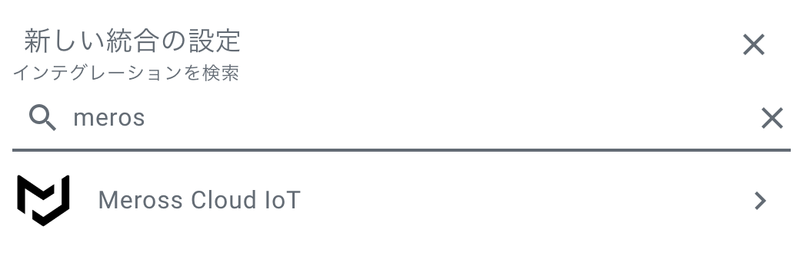

import MyYoutube from "../../MyYoutube";
import RakutenAffiliate from "../../RakutenAffiliate";
import Microlink from '@microlink/react'

### Meross（メーカ）とは
Merossは2016年に設立されたスマートホーム製品のメーカです。  
中国系で少し不安ですね。日本もこういうスタートアップ企業が出て来てほしいですね。

<Microlink url="https://www.meross.com/" />

非常に多様なスマートホーム製品を販売しています。
- スマートプラグ（今回購入したもの）
- スマート電球、スマート壁スイッチ
- サーモスタット用のバルブ
- 温湿度計

Home Assistant連携のためにPython APIを開発されている方もいます。  
嬉しいですね。

<Microlink url="https://github.com/albertogeniola/MerossIot" />

### MSS425F
今回購入したものはこちらになります。
<RakutenAffiliate
  url="https://hb.afl.rakuten.co.jp/ichiba/1e30a431.c8ac241a.1e30a432.d707e43f/?pc=https%3A%2F%2Fitem.rakuten.co.jp%2Fbiccamera%2F0619317770065%2F&link_type=picttext&ut=eyJwYWdlIjoiaXRlbSIsInR5cGUiOiJwaWN0dGV4dCIsInNpemUiOiIyNDB4MjQwIiwibmFtIjoxLCJuYW1wIjoicmlnaHQiLCJjb20iOjEsImNvbXAiOiJkb3duIiwicHJpY2UiOjEsImJvciI6MSwiY29sIjoxLCJiYnRuIjoxLCJwcm9kIjowLCJhbXAiOmZhbHNlfQ%3D%3D"
  title="MEROSS スマート電源プラグ 4口 + USB x 4 Google Home / Amazon Alexa / LINE Crova正式認証 MEROSS ホワイト MSS425FJP"
  imgurl="https://hbb.afl.rakuten.co.jp/hgb/1e30a431.c8ac241a.1e30a432.d707e43f/?me_id=1269553&item_id=13423719&pc=https%3A%2F%2Fthumbnail.image.rakuten.co.jp%2F%400_mall%2Fbiccamera%2Fcabinet%2Fproduct%2F6234%2F00000008888477_a01.jpg%3F_ex%3D240x240&s=240x240&t=picttext"
  value="価格：3980円（税込、送料別)"
  value_date="(2020/12/26時点)"
/>

4つのコンセントと4個のUSBを操作することができる電源タップです。  
ただし、**USBは個別に操作できないので注意してください**。

今はこんな感じで、水耕栽培用のライトとエアーポンプに使用しています。  
今後設備を大規模化したときに使っていこうと思います。

### 普通に使う
スマートフォンのMerossアプリから簡単に登録、操作できました。

この際に登録したメールアドレスとパスワードでHome Assistantと連携していきます。

### Home Assistantとの連携
Merossは専用のIntegrationが開発されています。  
対応しているデバイスと未対応のものがあります。ご注意ください。

LoveLace（状態ページ）はこんな感じにしました！  
あとは栽培用の機器を買い揃えるだけで自動化できそうです。

