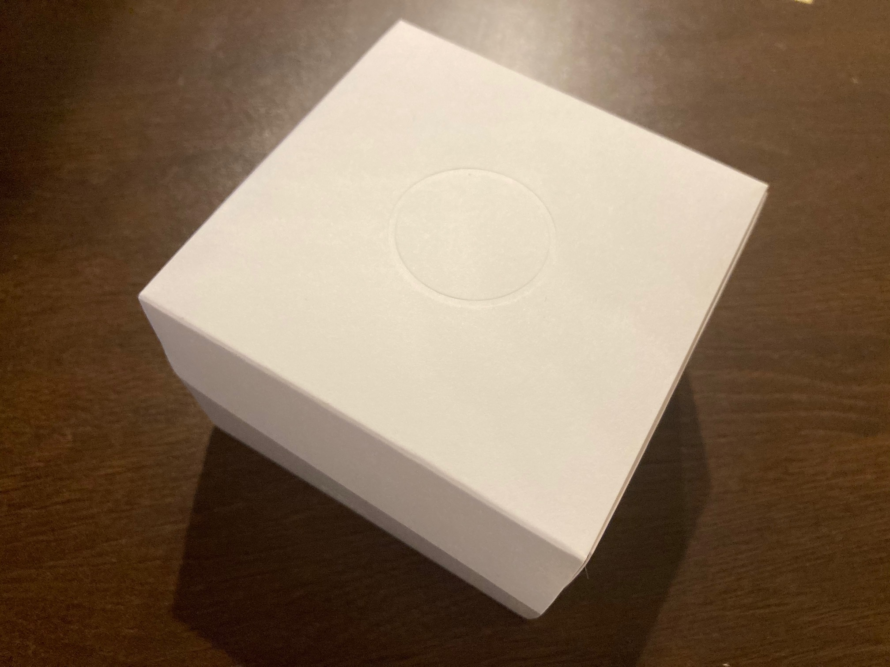
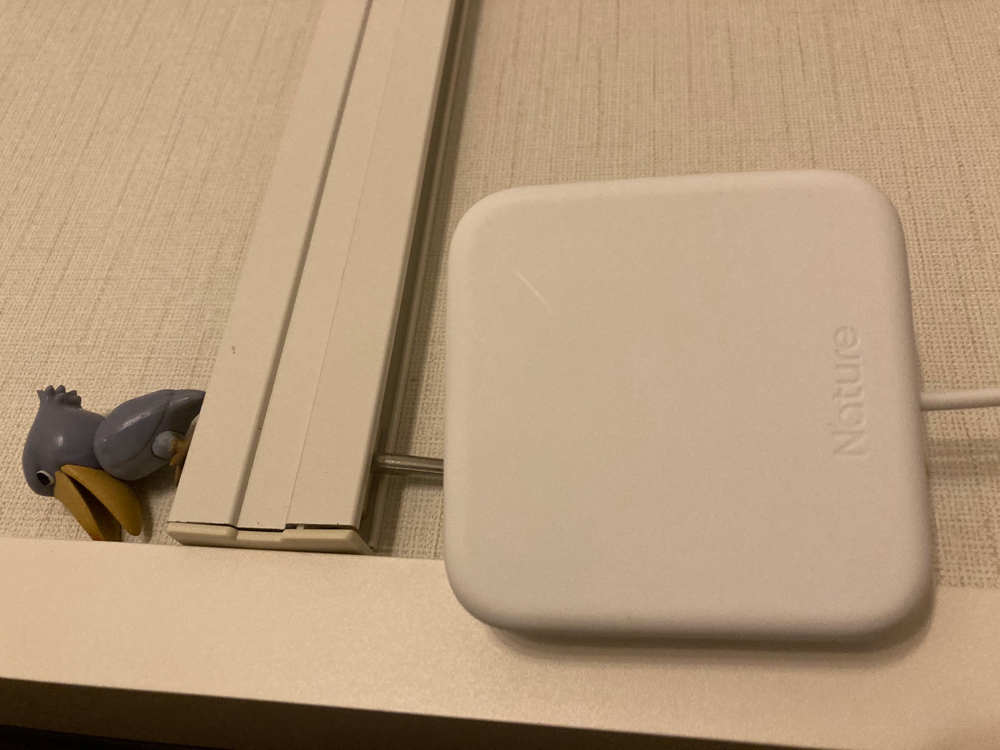
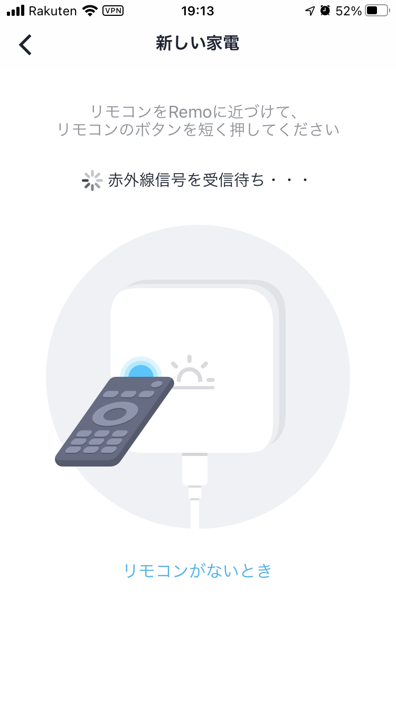
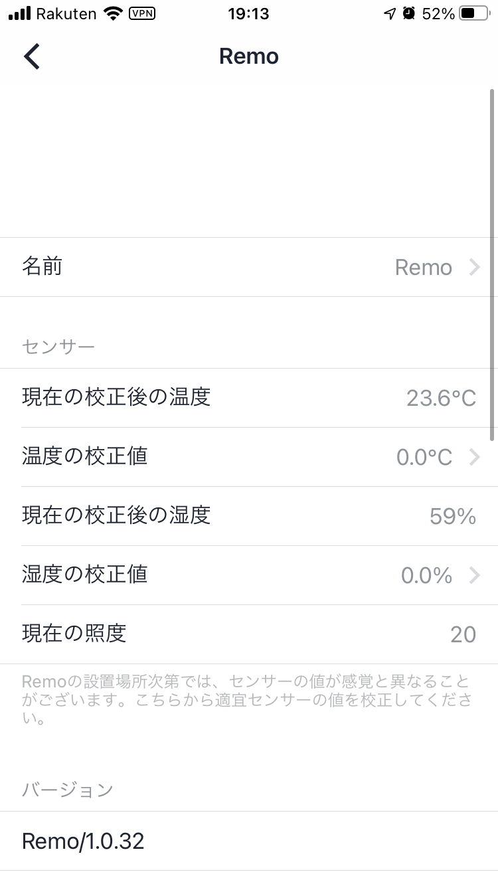
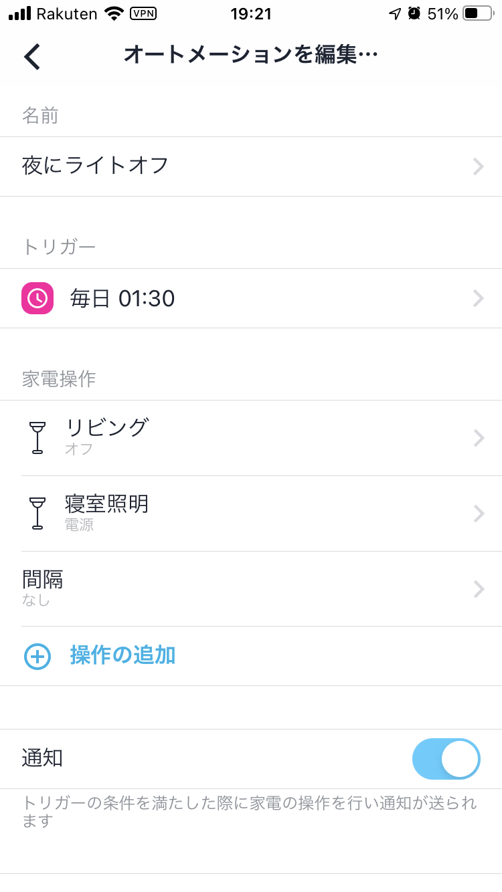
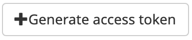

import MyYoutube from "../../MyYoutube";
import RakutenAffiliate from "../../RakutenAffiliate";

長くなるので記事を 2 つに分割します。

- [Nature Remo を Home Assistant で使う[1/2]](/nature-remoを-home-assistantで使う-1-2)
- [Nature Remo を Home Assistant で使う[2/2]](/nature-remoを-home-assistantで使う-2-2)

## Nature Remo とは

[公式サイト](https://nature.global/jp/nature-remo-3)が一番わかり易いです。

いわゆるスマートリモコンと呼ばれるもので、家電のリモコンの赤外線を覚えさせることで、
スマートフォンのアプリで家電を操作できるようになります。

スマートリモコンは海外製のものも結構ありますが、Nature Remo の販売会社は日本です。日本製です！  
後述しますが、スマートリモコンに家電を登録すると、販売会社はリモコンの操作権やセンサ値を管理することになります。  
中国製だとちょっと不安ですよね。

## Nature Remo の種類

こちらも[公式サイト](https://nature.global/jp/nature-remo-3)が一番わかり易いです。
[公式ブログの記事](https://nature.global/jp/blog/2020/6/25/remo3-difference)も参考になります。

注意すべきは**付属しているセンサーの種類**と**サイズ、重さ**です。  
Remo 3 は Remo 2 の上位互換になっています。

|          |               Remo 3                |               Remo 2                | Remo mini  |
| :------- | :---------------------------------: | :---------------------------------: | :--------: |
| 価格     |              ￥ 9,980               |              ￥ 8,980               |  ￥ 6,480  |
| センサー | 温度<br />湿度<br /> 照度<br />人感 | 温度<br />湿度<br /> 照度<br />人感 |    温度    |
| サイズ   |              70x70x18               |             74x74x17.9              | 58x58x15.6 |
| 重さ     |                 40g                 |                 61g                 |    29g     |

私はセンサがたくさん欲しかったので、最初から mini は選択肢に有りませんでした。  
Remo 2 と Remo 3 は 1000 円しか変わりませんし、
[楽天でタイミングを見計らって購入すれば 20%程度ポイント還元される](/楽天経済圏について)ので、Remo 3 を選びました。  
こういった企業を少しでも応援したい気持ちもあり、**購入に踏み切りました**。

<RakutenAffiliate
  url="https://hb.afl.rakuten.co.jp/ichiba/1d756ea1.2a4ca8db.1d756ea2.2302b4a0/?pc=https%3A%2F%2Fitem.rakuten.co.jp%2Fnature-remo%2Fremo-1w3%2F&link_type=picttext&ut=eyJwYWdlIjoiaXRlbSIsInR5cGUiOiJwaWN0dGV4dCIsInNpemUiOiIyNDB4MjQwIiwibmFtIjoxLCJuYW1wIjoicmlnaHQiLCJjb20iOjEsImNvbXAiOiJkb3duIiwicHJpY2UiOjEsImJvciI6MSwiY29sIjoxLCJiYnRuIjoxLCJwcm9kIjowLCJhbXAiOmZhbHNlfQ%3D%3D"
  title="Nature スマートリモコン Nature Remo 3 家電コントロール Amazon Alexa / Google Home / Siri 対応 GPS連携 温度センサー Bluetooth Low Energy Remo-1W3"
  imgurl="https://hbb.afl.rakuten.co.jp/hgb/1d756ea1.2a4ca8db.1d756ea2.2302b4a0/?me_id=1378660&item_id=10000006&pc=https%3A%2F%2Fthumbnail.image.rakuten.co.jp%2F%400_mall%2Fnature-remo%2Fcabinet%2Fremo-1w3%2Fimgrc0074113842.jpg%3F_ex%3D240x240&s=240x240&t=picttext"
  value="価格：9980円（税込、送料無料)"
  value_date="(2020/10/28時点)"
/>

## 通常の使い方

### セットアップ

Apple 製品を彷彿とさせるようなクールなデザインの箱で届きます。


配置は非常に重要です。赤外線が届く範囲に限界があるため、できるだけ部屋の中央、家電が直視できる位置が良いと思います。  
取得されるセンサ値もこの部屋の値になることを注意してください。

我が家の場合は約 4m の範囲であれば問題なく使えています。  
15cm 程度の壁の向こう側の部屋にあるシーリングライトにも届いています。



セットアップはすぐに済みます。スマートフォンの公式アプリを使って Remo に Bluetooth 接続し、Remo を Wifi につなげてあげます。

### リモコンの登録

非常に簡単にできます。

コントロールタブ右上のプラスボタンから家電の種類を選択し、Remo に向けて家電のリモコンのボタンを押します。


Remo が認識できた機器の場合はすべてのボタンが自動的に配置されます。認識できなかったものはポチポチ一つずつボタンを登録していきます。

残念ながら我が家の家電で自動配置されたのはエアコンだけでした。それでも十分すごいですけどね。

### センサ値

設定タブから自分のデバイスを選択すると現在のセンサ値が表示されます。


### オートメーション

あまり試していないのですが、ほぼほぼ[Home Assistant のオートメーション](/home-assitantのオートメーション)と同じことができます。

トリガーとして時間を選択し、毎日深夜 1:30 になると常夜灯を含めたすべてのライトが消えるように登録しました。



## Home Assistant との連携

今回は API を使った非常に簡単な連携を試してみます。

### アクセストークンの取得

なんと Nature Remo は API を公開しています！  
ますます応援したくなりますね。

まずはアクセストークンを取得します。
[こちら](https://home.nature.global/home)でログインし、以下のボタンでアクセストークンを生成します。



ランダムな長い文字列の token が生成されたと思うので、コピーしておきます。  
この token は非常に危険です。絶対に他の人に知られないようにします。

この token は二度と表示されません。なくしてしまったら Revoke して無効化し、もう一度新しいトークンを生成しましょう。

### API の使い方

[API の一覧](https://swagger.nature.global/)を見ながら必要なものを探していきます。

とりあえず現在のセンサ値を取得したいので、`GET`となっている項目を漁っていきます。  
[/1/devices](https://swagger.nature.global/#/default/get_1_devices)がお目当ての API なようです。

Raspberry Pi に ssh 接続して（PC でも構いません）、`curl`コマンドで取得してみます。  
JSON で返ってくるので、`jq`コマンドもインストールしてあることを確認してください。

```bash
curl -X GET "https://api.nature.global/1/devices" -H "authorization: Bearer ここにアクセストークン" | jq
```

以下のようなレスポンスがあるはずです。
湿度(hu, humidity)、照度(il, illuminance)、人感センサー(mo, motion)、温度（te, temperature）が得られているのが分かりますね。

```json
[
  {
    # 一部省略
    "firmware_version": "Remo/1.0.32",
    "temperature_offset": 0,
    "humidity_offset": 0,
    "newest_events": {
      "hu": {
        "val": 60,
        "created_at": "2020-10-28T10:29:17Z"
      },
      "il": {
        "val": 20,
        "created_at": "2020-10-28T10:37:30Z"
      },
      "mo": {
        "val": 1,
        "created_at": "2020-10-28T10:48:38Z"
      },
      "te": {
        "val": 23.4,
        "created_at": "2020-10-28T10:55:20Z"
      }
    }
  }
]
```

## 最後に

Nature Remo の選び方、そして通常の使い方と API の使い方を紹介しました。

スマートリモコンは古い家電のコントローラとして、スマートホームの必須アイテムになっています。  
Nature Remo はスマートコントローラの機能だけでなく、多数のセンサーを内蔵しており、汎用性の高い IoT デバイスです。

[次の記事](/nature-remoを-home-assistantで使う-2-2)では Home Assistant との連携について紹介してまいります。

<RakutenAffiliate
  url="https://hb.afl.rakuten.co.jp/ichiba/1d756ea1.2a4ca8db.1d756ea2.2302b4a0/?pc=https%3A%2F%2Fitem.rakuten.co.jp%2Fnature-remo%2Fremo-1w3%2F&link_type=picttext&ut=eyJwYWdlIjoiaXRlbSIsInR5cGUiOiJwaWN0dGV4dCIsInNpemUiOiIyNDB4MjQwIiwibmFtIjoxLCJuYW1wIjoicmlnaHQiLCJjb20iOjEsImNvbXAiOiJkb3duIiwicHJpY2UiOjEsImJvciI6MSwiY29sIjoxLCJiYnRuIjoxLCJwcm9kIjowLCJhbXAiOmZhbHNlfQ%3D%3D"
  title="Nature スマートリモコン Nature Remo 3 家電コントロール Amazon Alexa / Google Home / Siri 対応 GPS連携 温度センサー Bluetooth Low Energy Remo-1W3"
  imgurl="https://hbb.afl.rakuten.co.jp/hgb/1d756ea1.2a4ca8db.1d756ea2.2302b4a0/?me_id=1378660&item_id=10000006&pc=https%3A%2F%2Fthumbnail.image.rakuten.co.jp%2F%400_mall%2Fnature-remo%2Fcabinet%2Fremo-1w3%2Fimgrc0074113842.jpg%3F_ex%3D240x240&s=240x240&t=picttext"
  value="価格：9980円（税込、送料無料)"
  value_date="(2020/10/28時点)"
/>
