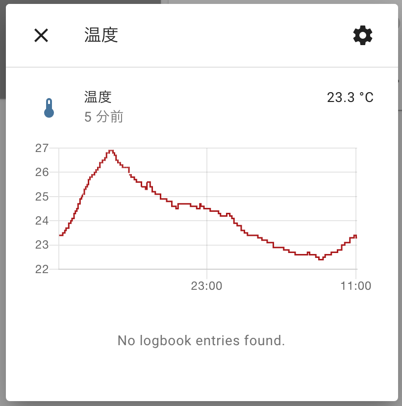
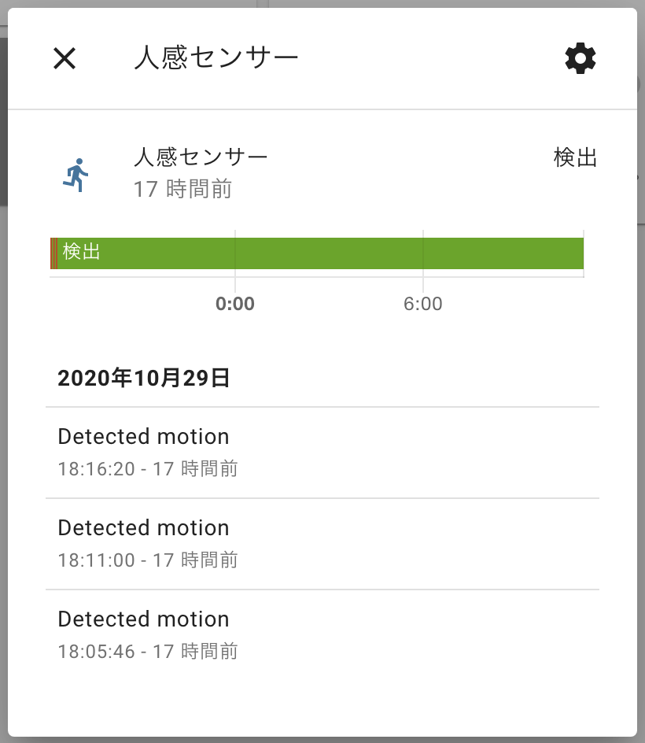
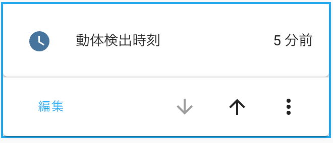

import MyYoutube from "../../MyYoutube";
import RakutenAffiliate from "../../RakutenAffiliate";

## 発生事象

[前回記事](/nature-remoを-home-assistantで使う-1-2)で紹介したとおり、Nature Remo のセンサ値を Home Assistant と連携して 1 日が経ちました。

刻々と変化していく温度や湿度をみて、これを何に使ってやろうかホクホクしていた矢先の出来事でした。



なんと、人感センサーが常に 1 のままだったのです。むなしいですね笑  
Nature Remo はリビングにおいているので、深夜は人感センサーは反応しないはずです。


すこしググってみると、[こんな記事](https://zlog.hateblo.jp/entry/2019/07/07/Nature-remo-motion-sensor)を見つけました。

わかったことは

1. `mo.val`の値は常に 1
1. 人感センサが反応すると、Nature のサーバの`mo.creates_at`がアップデートされる

ということです。

だから Nature Remo スマホアプリのオートメーションも、
`センサーが反応したら`や`センサーが30分間反応しなかったら`がトリガーになっているんですね。

後々利用することを考え、**最後にセンサーが反応した時刻**をそのままエンティティに登録していこうと思います。

## timestamp の登録

最初に答えを書いておきます。[前回記事](/nature-remoを-home-assistantで使う-2-2)で設定した内容の最後に追記しています。
エンティティの名前は`remo_motion_updated`にしました。

```yaml:title=sensors.yaml
- platform: rest
  scan_interval: 60
  resource: https://api.nature.global/1/devices
  name: remo_sensors
  headers:
    authorization: !secret nature_remo_api_token
  value_template: "OK"
  json_attributes_path: "$[0].newest_events"
  json_attributes:
    - hu
    - il
    - mo
    - te
- platform: template
  sensors:
    remo_temperature:
      value_template: '{{ states.sensor.remo_sensors.attributes["te"]["val"] }}'
      unit_of_measurement: "°C"
      device_class: temperature
      friendly_name: 温度
    remo_humidity:
      value_template: '{{ states.sensor.remo_sensors.attributes["hu"]["val"] }}'
      unit_of_measurement: "%"
      device_class: humidity
      friendly_name: 湿度
    remo_illuminance:
      value_template: '{{ states.sensor.remo_sensors.attributes["il"]["val"] }}'
      device_class: illuminance
      friendly_name: 照度
    remo_motion_updated:
      value_template: '{{ states.sensor.remo_sensors.attributes["mo"]["created_at"] }}'
      friendly_name: 動体検出時刻
      device_class: timestamp
```

カードにすると、こんな感じです！  
`created_at`は UTC なので処理が面倒かな〜とか思ったりしてたんですが、
勝手に日本時間に変換して、さらにいい感じ（xx 分前）に表示してくれて感動しました笑



## 最後に

Nature Remo API の仕様をきちんと把握せずに人感センサーの値を取り出していました。
やっぱり Nature Remo の中の人にインテグレーションを作ってもらいたいですね。
