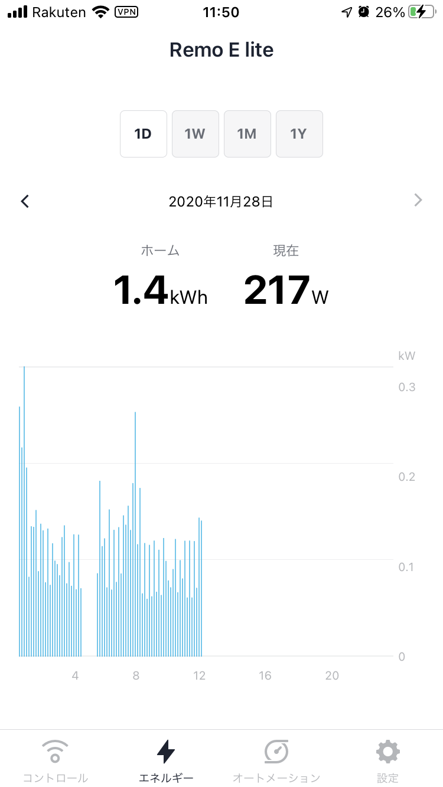

import MyYoutube from "../../MyYoutube";
import RakutenAffiliate from "../../RakutenAffiliate";

### Nature Remo Eとは
[公式サイト](https://nature.global/jp/nature-remo-e)をご覧ください。

家庭の消費電力がリアルタイムで把握できるIoT機器です。  
消費電力を見ているだけでも楽しいですが、
スマートリモコンNature Remoと組み合わせて使用することで、
さらに威力を発揮します。

<RakutenAffiliate
  url="https://hb.afl.rakuten.co.jp/ichiba/1d756ea1.2a4ca8db.1d756ea2.2302b4a0/?pc=https%3A%2F%2Fitem.rakuten.co.jp%2Fnature-remo%2Fremo-4w1%2F&link_type=picttext&ut=eyJwYWdlIjoiaXRlbSIsInR5cGUiOiJwaWN0dGV4dCIsInNpemUiOiIyNDB4MjQwIiwibmFtIjoxLCJuYW1wIjoicmlnaHQiLCJjb20iOjEsImNvbXAiOiJkb3duIiwicHJpY2UiOjEsImJvciI6MSwiY29sIjoxLCJiYnRuIjoxLCJwcm9kIjowLCJhbXAiOmZhbHNlfQ%3D%3D"
  title="Nature Remo E lite"
  imgurl="https://hbb.afl.rakuten.co.jp/hgb/1d756ea1.2a4ca8db.1d756ea2.2302b4a0/?me_id=1378660&item_id=10000005&pc=https%3A%2F%2Fthumbnail.image.rakuten.co.jp%2F%400_mall%2Fnature-remo%2Fcabinet%2Fremo-4w1%2Fimgrc0073826990.jpg%3F_ex%3D240x240&s=240x240&t=picttext"
  value="価格：14800円（税込、送料別)"
  value_date="(2020/11/28時点)"
/>

### 購入の経緯
|日付| できごと|
|:---:|:---|
|11/21| ブラックフライデーで公式サイトのクーポンで9,980円に値下げされていたので、何も考えずにポチる|
|11/23| 東京電力のBルートサービスに申し込む|
|11/24| Bルートサービスの申込確認メールが届く|
|11/26| Bルートサービスのパスワードだけメールで届く Nature Remo Eが届く|
|11/27| BルートサービスのIDが郵送で届く|

Bルートサービスの登録は想定よりも非常に早かったです。  
重要なのは電力を供給している電力会社に申し込むこと。  
電力の販売会社（楽天でんき等）を探しても見つかりません。

Nature のブラックフライデーでは、Nature Remo E Liteの他、
[Nature Remo 第2世代](/nature-remoを-home-assistantで使う-1-2)が5,980円になっていました。

### セットアップ
2.4GHzのWifiが届きかつ、スマートメータ（玄関）に近いコンセントに差し込みました。

スマートメータ検索時に少し時間がかかり焦りました。  
玄関の扉を開けたのが効果があったのか、その後無事に繋がりました。  
今は扉を閉じた状態でもモニタリングできています。

### 活用方針
せっかく購入したので使い倒したいですよね。何に使うか考えてみました。

#### 遠隔操作のフィードバック
遠隔設計の基本は2つです。
1. 遠隔で何らかの操作を行うこと
2. 1.の操作が正確に行われたかの確認

スマートコントローラ Nature Remoを使うと遠隔で家電を制御することはできます。  
しかし、家電が本当に制御されたかどうか確認することまではできません。  
暖房を消したはずなのにONのまま、スマートロックで部屋の鍵を閉めたはずなのに開いたまま、みたいな状態ではとても困ります。  
シュレーディンガーの猫ですね。

<RakutenAffiliate
  url="https://hb.afl.rakuten.co.jp/ichiba/1dcdc9b7.53c9cec2.1dcdc9b8.b3015a01/?pc=https%3A%2F%2Fitem.rakuten.co.jp%2Fnetlandshop%2F4932302750778%2F&link_type=picttext&ut=eyJwYWdlIjoiaXRlbSIsInR5cGUiOiJwaWN0dGV4dCIsInNpemUiOiIyNDB4MjQwIiwibmFtIjoxLCJuYW1wIjoicmlnaHQiLCJjb20iOjEsImNvbXAiOiJkb3duIiwicHJpY2UiOjEsImJvciI6MSwiY29sIjoxLCJiYnRuIjoxLCJwcm9kIjowLCJhbXAiOmZhbHNlfQ%3D%3D"
  title="Nature スマートリモコン Nature Remo 3 ネイチャーリモ Remo-1W3 Alexa/Google Home/Siri対応"
  imgurl="https://hbb.afl.rakuten.co.jp/hgb/1dcdc9b7.53c9cec2.1dcdc9b8.b3015a01/?me_id=1390591&item_id=10000157&pc=https%3A%2F%2Fthumbnail.image.rakuten.co.jp%2F%400_mall%2Fnetlandshop%2Fcabinet%2Fr_1600330213%2F4932302750778.jpg%3F_ex%3D240x240&s=240x240&t=picttext"
  value="価格：13686円（税込、送料無料)"
  value_date="(2020/11/28時点)"
/>

このため、上記2.の手段が重要になってきます。  
安直に確認手段を挙げてみると、
1. 双方向通信の機器を使う（エアコンはこのタイプが多いのだと思います）
1. スマートプラグ等の状態を外部サーバで管理する機器を使う
1. カメラを付けて監視する
1. センサーで監視する（温度や照度で判断するとか）

1.2.は対応製品を購入する必要があります。  
3.4.はかなり信頼性に欠けますよね。

しかし、今回Nature Remo E Liteを導入したことによって、**リアルタイムの電力から機器の状態を判断する**ことができるようになりました。  
簡単に言えば、機器ON/OFF前後の電力の差分を確認することで、機器の状態を把握しようということです。

以下のように単純にAPIを使用することでフィードバックします。
1. [/1/appliances](https://swagger.nature.global/#/default/get_1_appliances)で電力を取得
2. [/1/appliances/{appliance}/light](https://swagger.nature.global/#/default/post_1_appliances__appliance__light)等で家電を操作
1. もう一度[/1/appliances](https://swagger.nature.global/#/default/get_1_appliances)で電力を取得し、差分を確認

APIの使用回数が増えてしまいますが、致し方ないでしょう。  
そういう用途で開発されたものですからね。  
[Local API](https://local-swagger.nature.global/)で取得できればそれに越したことはありませんが、今の所実装されていないようです。

#### アラートを設定する
非常に単純です。

HomeAssistantで常時モニタリングし、一定値を超えたときに、
- Google Homeにttsを送る
- Home Assistantのスマートフォンアプリに通知させる
だけです。

電力をずっと見ていることなんて無いですから、なんらかの通知があると嬉しいですよね。

